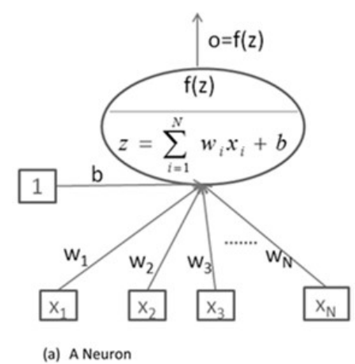
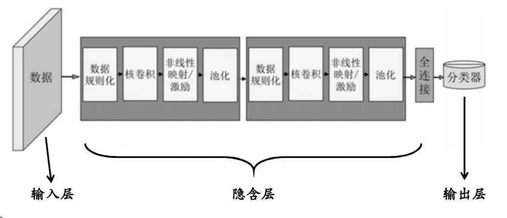
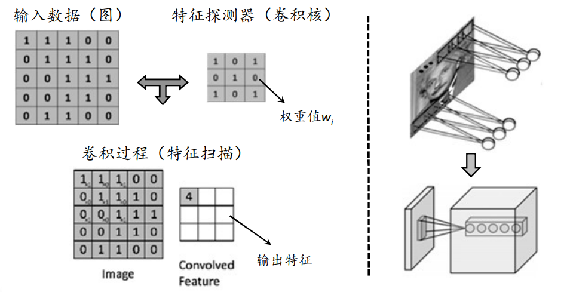
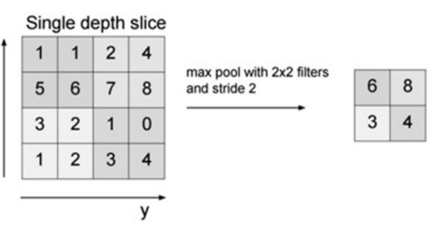
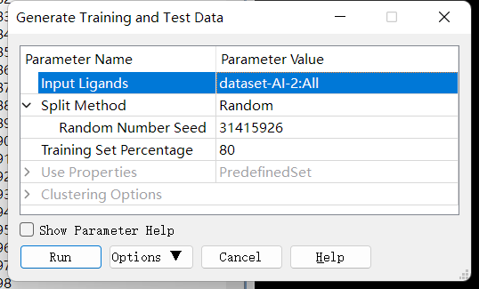
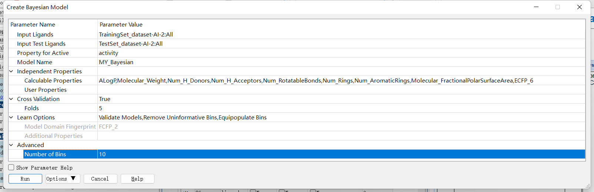
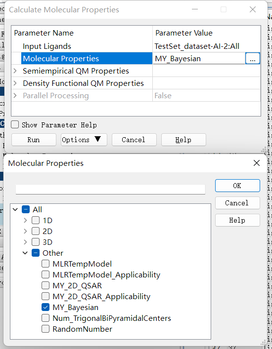

基于人工智能的药物设计(Artificial Intelligence-based Drug Design)
=================================================================

问题：多样性抑制剂如何建模？
解决方法：模式识别是以建立分类模型为目的算法统称，常以非线性方法做为算法基础，通过迭代优化获得稳定模型（机器学习过
程）。当生物活性可定性分为有效和无效时，判别分析可以根据化合物属性（分子描述符）进行分类，建立的判别模型可用来预测新化合物的属性类别。

机器学习的概念
------------------------

机器学习（Machine Learning，ML）是一门多领域交叉学科，涉及概率论、统计学、算法复杂度理论等多门学科，其专门研究计算机如何模拟人类学习行为，以获取新知识或技能，并重新组织已有知识结构，不断改善自身性能。机器学习是人工智能的核心（Artificial Intelligence，AI ），其应用遍及人工智能的各个领域（ML≈AI）。机器学习主要使用归纳、总结而不是演绎、推理。

人工智能的发展简史
--------------------

人工智能在20世纪五六十年代被正式提出，至今发展超过60年

1946年，第一台电子数字计算机ENIAC（埃尼阿克）问世

1950年马文·明斯基（Marvin Lee Minsky）建造了世界上第一台神经网络计算机，这也被看做是人工智能的起点。

1956年，在由达特茅斯学院举办的一次会议上（Dartmouth Conference），计算机专家约翰·麦卡锡（John McCarthy）提出了“人工智能”一词，后来被认为是人工智能正式诞生的标志。其他与会专家：马文·明斯基（Marvin Lee Minsky，人工智能之父）、克劳德·香农（Claude Shannon，信息论的创始人）、赫尔伯特·西蒙（Herbert Simon，诺贝尔经济学奖得主）等科学家。

1997年，IBM的DeepBlue（“深蓝”）战胜国际象棋世界冠军。它存有70万份大师对战的棋局数据，可搜寻并预测随后的12步棋

2016年3月，AlphaGo以4:1击败韩国围棋冠军李世石，成为近年来人工智能领域重要的里程碑事件（2017年击败国际冠军柯洁） 

2017年，AlphaGo Zero（第四代AlphaGo）在无任何输入数据的情况下，自学围棋3天后便以100:0横扫第二版AlphaGo，学习40天后又战胜了在人类高手看来不可企及的第三版AlphaGo —“大师”（AlphaGo Master）

    AlphaGo是由Google旗下DeepMind团队开发的人工智能围棋程序，具有自我学习能力，其能够搜集大量围棋对弈数据和名人棋谱，学习并模仿人类下棋

科研工作中的人工智能
::::::::::::::::::::::::

.. image:: /images/58.png

.. image:: /images/59.png

Marwin H. S. Segler, et al., Nature, 2018, 555, 604-610.

Chemputer

.. image:: /images/60.png

.. image:: /images/61.png

Leroy Cronin*, Nature, 2018, 559, 377-381.

.. image:: /images/62.png

Leroy Cronin*, Science, 2020, 370, 101-108.

A mobile robotic chemist

.. image:: /images/63.png

Andrew I. Cooper*, Nature, 2020, 583, 237-241.

人工智能在药物发现中的应用

.. image:: /images/64.png

* 靶标的识别：药物靶标的鉴别通常也是药物设计中最难的一步，其通常以大数据为数据基础，通过整合系统生物学（生物网络分析）、生物信息学/计算生物学（数据挖掘与建模）、结构生物学（蛋白三维结构表征）、药理/毒理学（药物的作用机制及代谢途径等）等多学科的交叉来实现新靶点的发现。

   * 生物标记物的鉴别（biomarker identification）
   * 靶标结构建模（protein modeling）
  
      * 蛋白建模：AlphaFold2 在第14届蛋白结构预测大赛中（Critical Assessment of Structure Prediction，CASP）甩第二名于无形（Baker Group），一举解决了蛋白的结构预测问题，并对人类全蛋白组结构进行了预测（>98%）。

      .. image:: /images/65.png

      * 基于深度神经网络的从头预测
  
         * 成对的氨基酸之间的距离
         * 连接这些氨基酸的化学键之间的角度
         * 进化信息
         * 在整个PDB数据库进行训练

   * 蛋白-蛋白相互作用（protein protein interaction，PPI）

* 苗头化合物的发现：
  
   * 虚拟筛选（Virtual Screening）
   * 老药新用（Drug Repurposing） 
  
* 苗头化合物的优化（先导化合物的设计）：

   * 高活性先导化合物的发现：基于组合库，非线性回归（SVR）建模优化候选活性剂结构，使其成为先导化合物

* 先导化合物的优化（ADMET性质的预测）：对先导化合物进行代谢、吸收、毒性等方面的预测和进一步优化，使其获得更好的体内活性

基于机器学习的判别模型构建（Constructing Classification Model based on Machine Learning Approaches）
-----------------------------------------------------------------------------------------------------

* 监督学习（supervised learning）：监督学习，即在机器学习过程中提供标识（目标已知）。监督学习可以从给定训练集中学习出一个函数，通过迭代优化（自我学习）减少模型误差，达到精确预测目的。常见的监督学习算法包括回归分析（regression）和判别分类（classification）
* 非监督学习（unsupervised learning）：非监督学习又称归纳学习，其一般在机器学习过程中没有给定明确标识（目标未知），需要通过迭代优化来确定相关属性。常见方法包括聚类分析（clustering）。

判别模型构建的一般流程
::::::::::::::::::::::::::::::

采集数据 -> 处理模型 -> 构建 -> 外部检测

Database Paper(ChemDraw) -> Descriptor calculation and selection -> Machine learningCross-validation -> Model testing

数据集构建:

正样本活性剂的获取：（BindingDB、ChEMBL、PubChem等）

.. image:: /images/66.png

负样本非活性剂的获取：

.. image:: /images/67.png

一般认为，筛选模型的构建需要扩大活性剂与非活性剂的数量比值，如1:100，其原因在于自然界中天然抑制剂的数量要远小于化合物分子的化学空间。

描述符计算

* 化学描述符的计算与传统2D、3D回归QSAR类似，可分为2D描述符（组成性、理化性质、分子片段、拓扑结构描述符等）和3D描述符（各种分子场等）
* 在QSAR研究中常遇到所选用分子描述符之间存在不同程度的相关性，因而使得提供的信息发生重叠，掩盖了要分析的问题本质。因此在数学上可以通过降维的方式来提取主要信息，常用的方法包括系统选择法、主成分分析方法（Principal Component Analysis，PCA）等

判别模型的构建

交互验证与外部检测

模型检验

* 内部验证（5倍或10倍交叉验证）
* 外部验证（预留的部分数据集或外部数据集）

判别模型的精度指标（定性指标）

* TP（true positive）：判断正确的正样本数
* FP（false positive）：判断错误的正样本数
* TN（true negative）：判断正确的负样本数 
* FN（false negative）：判断错误的负样本数
* Positive = TP + FP
* Negative = TN + FN
* SE（sensitivity）：敏感度 :math:`SE = \frac{TP}{TP + FN}`   (0,1)
* SP（specificity）：特异性 :math:`SP = \frac{TN}{TN + FP}`   (0,1)
* GA（global accuracy）：全局准确率（仅用于平衡样本判别） :math:`GA = \frac{TP + TN}{TP + TN + FP + FN}`   (0,1)
* MCC（Matthews correlation coefficient）：马修斯系数（平衡样本和非平衡样本均适用） :math:`MCC = \frac{TP × TN - FN × FP}{\sqrt{(TP + FN)(TP + FP)(TN + FN)(TN + FP)}}`   (-1,1)

非平衡样本中MCC判定的重要性：

假设1:100的数据集中负样本全部判断正确，正样本全部判断错误，则 GA>99%，因而在非平衡数据集中应采用MCC等判断标准，如图，当正样本多数判断错误时，MCC趋近于0，与事实相符合。

.. image:: /images/68.png

定量预测指标—AUC

AUC（area under curve，AUC）：线下面积（0~1），由受试者工作特征曲线（receiver operating characteristic curve，ROC）得出。适用于两组不同类别数据对同一种打分形式的排序（如分类模型对每个对象的打分、概率等）

不限于机器学习，其适用于各种平衡、非平衡样本的二分类问题

判别模型可用标准

* 对于一个平衡数据集（1:1），当一个模型的GA值在内外测试中均达到0.8以上时表明模型的精度较为可靠，可用于推广研究（GA≥0.8）
* 当一个模型的MCC值在内外测试中均达到0.5以上时表明模型的精度较为可靠，可以用于实际的虚拟筛选或预测研究（MCC≥0.5）
* 若内测与外测MCC或GA值相差悬殊（如ΔMCC>0.3；ΔGA>0.2 ），则表明所构建模型过拟合比较严重，需要重新构建模型

判别模型的特点及注意问题

* 可用于多样性分子判别，不强调分子结构是否相似或作用机制是否相同
* 模型构建时，训练集的样本容量一般较大
* 分类模型的构建不考虑一个活性分子的具体活性值，只区分是否有活性，如活性剂（active）或非活性剂（inactive），一般认为IC50<10 μM的分子为活性剂
* 平衡样本（1:1）的分类模型可以使用全局准确率（global accuracy，GA）或马修斯系数（MCC）来判断模型的精度，非平衡样本（如1:100）只能使用MCC值等来判断模型精度

常用的人工智能算法 Commonly used Machine Learning Algorithms
------------------------------------------------------------------

* 朴素贝叶斯（Naive Bayesian，NB）
* 决策树与随机森林（Decision Tree and Random Forest，DT and RF）
* 支持向量机（Support Vector Machine，SVM）
* 人工神经网络（Artificial Neural Network，ANN）
* 深度学习（Deeping Learning）
 
    深度神经网络（Deep Neural Network，DNN）

    卷积神经网络（Convolutional Neural Network，CNN）

    循环神经网络（Recurrent Neural Network，RNN）

    对抗神经网络（GAN）、强化学习（RL）、变分自编码器（VAE）等

朴素贝叶斯（Naive Bayesian，NB）
::::::::::::::::::::::::::::::::::::

* 朴素贝叶斯法是基于贝叶斯定理与特征条件独立假设的分类方法
* 朴素贝叶斯分类器（Naive Bayes Classifier，NBC）发源于古典数学理论，具有坚实的数学基础，以及稳定的分类效果

NBC工作原理

.. math:: 
    条件概率： P(A|B) = \frac{P(AB)}{P(B)}
.. math:: 
    全概率公式： P(A) = \sum_iP(A|B_i)P(B_i)
.. math:: 
    贝叶斯公式： P(B_i|A) = \frac{P(A|B_i)P(B_i)}{\sum_jP(A|B_j)P(B_j)} \Rightarrow p(C|F_1, F_2, ..., F_n) = \frac{p(F_1, ..., F_n|C)p(C)}{p(F_1, ..., F_n)}

贝叶斯公式在药物设计预测模型中的含义：当某分子含有某特征时（F1~Fn），它成为活性剂或非活性剂的概率，概率大的一方为该分子所属类别。

NBC算法举例

8个分子，5个活性剂，3个非活性剂。已知活性剂带芳香环的概率为0.8，非活性剂带芳香环的概率为0.3，现从8个分子中随机挑选一个，结果其带芳香环。求该分子为活性剂的概率是多少？ 0.8163

NBC特点

优点：NBC模型不需要额外的核函数映射输入数据，所需估计的参数较少，对缺失数据不敏感，算法清晰便于理解

缺点：NBC模型假设属性之间相互独立，这个假设在实际应用中通常较难成立，其会对NBC模型的分类精度产生一定影响

决策树与随机森林（Decision Tree and Random Forest，DT and RF）

* 决策树是一种树型结构，其中每个内部结点表示在一个属性上的测试，每个分支代表一个测试输出，每个叶结点代表一种类别 
* 决策树学习是以实例为基础的归纳学习
* 决策树学习采用的是自顶向下的递归方法，其基本思想是以信息熵为度量构造一棵熵值下降最快的树，到叶子节点处的熵值为零，此时每个叶节点中的实例都属于同一类 

DT特点

优点：决策树算法的最大优点是它可以自学习，其在学习的过程中不需要使用者了解过多背景知识，只需要对训练实例进行较好的标注

缺点：决策树对训练集通常有较好的分类能力，但对未知的测试数据未必有好的分类能力，即泛化能力弱，容易发生过拟合现象

解决方法：随机森林（RF）

RF工作原理

* 从样本集中随机采样选出n个样本
* 从所有属性中随机选择k个属性，选择最佳分割属性作为节点建立决策树
* 重复以上两步m次，即建立m棵决策树
* 这m棵决策树形成随机森林，通过投票表决结果决定数据属于哪一类

上述案例也可以使用NBC等其它分类器进行操作，习惯上，这些分类器组成的“总分类器”，仍然叫做随机森林

支持向量机（Support Vector Machine，SVM）

发展简史： 

* 1963年，Vapnik在解决模式识别问题时提出了支持向量方法 
* 1995年，Vapnik正式发布了支持向量机算法

理论基础：统计学习理论（VC维理论，Vapnik-Chervonenkis Dimension）

特点：小样本、非线性、高维模式 

SVM工作原理

SVM是从线性可分情况下的最优分类面发展而来

.. image:: /images/69.png

* 图中方形点和圆形点代表两类样本，H为分类线，H1、H2分别为过各类中离分类线最近的样本且平行于分类线的直线，它们之间的距离叫做分类间隔（margin）
* 所谓最优分类线就是要求分类线不但能将两类正确分开（训练错误率为0），而且使分类间隔最大
* 推广到高维空间，最优分类线就变为最优分类面
* 一般情况下，分类样本情况复杂，很难用简单线性算法对目标体系进行区分，因此需要引入复杂数理统计方法（如核函数）对数据进行处理
* 核函数（kernel function）的基本功能为接受两个低维空间的向量，计算其在高维空间中经过某种变换的内积非线性映射到线性
* 核函数种类：线性核函数，多项式核函数 Sigmoid核函数，径向基核函数（Radial Basis Function，RBF）
  
人工神经网络（Artificial Neural Network，ANN）

* 人工神经网络（ANN）是20世纪80年代以来人工智能领域兴起的研究热点
* 人工神经网络从信息处理角度对人脑神经元网络进行抽象，建立简化模型，根据不同的连接方式设计不同网络架构

ANN工作原理

神经元模型:

* x1~xn为输入向量的各个分量
* w1~wn为神经元各个突触的权值
* b为偏置
* f为传递函数（激励函数），通常为非线性函数
* o为神经元输出
* 数学表示o=f(WX'+b)

常用激励函数：

* Sigmoid
* tanh
* ReLU（Rectified Linear Units）
* Softplus

神经网络是一种运算模型，由大量节点（或称神经元）相互连接构成，每个节点代表一种特定的输出函数，称为激励函数（activation function）

每两个节点间的连接都代表一个通过该连接信号的加权值，称之为权重，其相当于人工神经网络的记忆

网络的输出则依据网络的连接方式（拓扑结构）、权重值、激励函数的不同而变化

多个神经元相互作用形成神经网络

.. image:: images/71.png

深度学习（Deep Learning，DL）

深度学习的概念由Hinton于2006年提出，其概念源于人工神经网络

深度学习可以认为是含多个隐含层的人工神经网络

深度学习通过组合低层特征形成更抽象的高层特征，以发现数据的分布式规律

深度学习特点

传统模型特点：固定特性+简单分类

深度学习模型特点：自学习给定输入数据特征+学习分类器

与传统人工智能相比，深度学习最大特点在于其能够自学习与任务相适应的特征

卷积神经网络（Convolutional Neural Network，CNN）

卷积神经网络（CNN）是一类包含卷积或相关计算且具有深度结构的前馈神经网络（Feedforward Neural Network），是深度学习的代表算法之一

卷积神经网络的研究始于二十世纪80至90年代，在二十一世纪后，随着数值计算设备的改进，卷积神经网络得到了快速发展，并被大量应用于计算机视觉、自然语言处理等领域

CNN工作原理

输入层

隐含层

（1）卷积层（convolutional layer）：卷积核（convolutional kernel），激励函数（activation function）等

（2）池化层（pooling layer）

（3）全连接层（fully-connected layer）

输出层

卷积层（convolutional layer）：卷积层的功能是对输入数据进行特征提取，其内部包含多个卷积核，组成卷积核的每个元素都对应一个权重值

卷积层内每个神经元都与前一层中位置接近的区域的多个神经元相连，区域的大小取决于卷积核的大小，被称为“感受野（receptive field）”，其含义可类比视觉皮层细胞的感受野

卷积层作用：特征提取与放大

池化层（pooling layer）：又称汇聚层，在卷积层进行特征提取后，输出的特征图会被传递至池化层进行特征选择和信息过滤 

池化层作用：降低输出规模、增加可解释性、防止过拟合

全连接层（fully-connected layer）：卷积神经网络中的全连接层等价于传统前馈神经网络中的隐含层

全连接层通常搭建在卷积神经网络隐含层的最后部分，并只向其它全连接层传递信号

特征图在全连接层中会失去三维结构，被展开为向量并通过激励函数传递至下一层

LeNet-5：手写字体识别模型（LeNet-5）诞生于1994年，是最早的卷积神经网络之一

基于机器学习的判别模型构建实验
-------------------------------

实验目的：
::::::::::::::::::::::::

1. 了解数据集中正负样本处理方法。
2. 掌握模型构建与结果分析。
3. 掌握未知化合物活性预测。

实验原理：
:::::::::::

使用 Discovery Studio 软件进行，以朴素贝叶斯为例对 FXR 活性剂与非活性剂进行机器学习判别模型构建。

本实验所用软件环境：

* DS Version：19.1.0.18287
* PP Version：19.1.0.1963
* DS Client Version：19.1.0.18287
* OS Distribution：Windows
* OS Version：10.0.22000

判别模型建模一般流程:

* 已知活性数据收集
* 数据集预处理（正样本/负样本、训练集/测试集准备等）
* 分子描述属性计算（传统分子描述符、分子指纹等）
* 模型构建（机器学习算法）
* 外部数据集检测
* 未知化合物类别预测

实验步骤：
::::::::::::

1. 已知活性数据收集：本实验使用指导老师提供的 dataset-AI-2.sdf 数据集。 `下载`_

.. _下载: https://abdusemiabduweli.github.io/CADD-Tutorial-Experiments-Result/experiment_results/GenerateTrainingandTestData_2022_09_17_181435_596/Input/dataset-AI-2.sd

2. 数据集预处理（正样本/负样本、训练集/测试集准备等）：本实验中，指导老师已经做好了正样本和负样本的分类。训练集/测试集的准备：点击 Discovery Studio 软件上的 Small Molecules→Create QSAR Model→Generate Training and Test Data 进行训练集与测试集拆分。完成后，点击报告中的 test set 和 training set 设置参数如下：

3. 分子描述属性计算（传统分子描述符、分子指纹等）：Discovery Studio 会在模型的构建中自动计算。在构建模型时，只需在 Calculable Properties 中挑选要计算的描述符。
   
4. 模型的构建与内外部验证：点击 Discovery Studio 软件上的 Small Molecules → Create QSAR Model → Create Bayesian Model 进行朴素贝叶斯模型的构建。设置参数如下：

5. 未知活性化合物预测：未知活性化合物数据集用的是已知活性数据收集，点击 Discovery Studio 软件上的 Small Molecules → Calculate Molecular Properties → CalculateMolecular Properties 进行未知活性化合物预测。设置参数如下：

实验结果：
::::::::::::::::::::::

`数据集预处理结果`_,  `模型的构建结果`_ ， `未知活性化合物预测的结果`_

.. _数据集预处理结果: https://abdusemiabduweli.github.io/CADD-Tutorial-Experiments-Result/experiment_results/GenerateTrainingandTestData_2022_09_17_181435_596/Output/Report.htm

.. _模型的构建结果: https://abdusemiabduweli.github.io/CADD-Tutorial-Experiments-Result/experiment_results/CreateBayesianModel_2022_09_17_181943_282/Output/Report.htm

.. _未知活性化合物预测的结果: https://abdusemiabduweli.github.io/CADD-Tutorial-Experiments-Result/experiment_results/CalculateMolecularProperties_2022_09_17_182155_807/Output/Report.htm

讨论：
::::::::::

可以从在内外部验证中所得出的模型精度指标看出，内部验证MCC为0.991，外部验证MCC为0.931。因为内外部验证ΔMCC<0.3，所以此模型可以用于实际的虚拟筛选或预测研究（MCC≥0.5）
