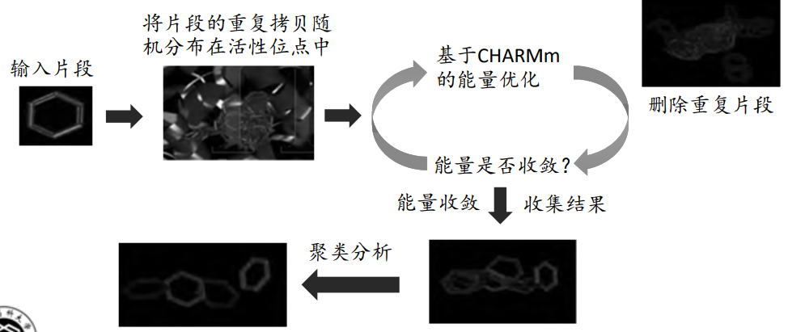

基于片段的药物设计(Fragment‐based drug design)(FBDD)
========================================================

引言
----------

结构优化的困惑

* 许多药物靶标的活性位点是由多个口袋组成。高通量筛选的化合物过于“成熟”，通常不能与靶蛋白很好地结合，而对于其中单个片段的优化往往会影响整个分子，甚至导致结合位置的改变高通量筛选或虚拟筛选得到的苗头化合物与靶标蛋白的结合模式。
* 苗头化合物或先导化合物的优化，大多以加入或变换基团，以增加与靶标结合的机会和强度。一般“不敢”轻易除去基团或片段，以免丢失参与结合的原子或基团（即药效团）。
  
换一种思路：从分子量较小的片段分子出发！

由高通量筛选获得的苗头化合物与先导化合物在分子大小、亲酯性和极性表面积等理化参数上几乎一样，但是活性却比先导物差了很多，这就说明了HTS苗头化合物的成药质量差（药效和理化性质的不平衡）。相反，片段分子的活性虽弱，但可覆盖更全
面的化学空间，可在优化过程中保持分子的成药质量。

基于片段的药物设计原理
-------------------------------------

基于片段的药物设计（Fragment‐based drug design, FBDD）是一种将高通量筛选和基于结构的药物设计相结合的药物发现新方法。由于筛选的起始物是较小的分子，与受体结合的自由度与可能性较大，这是有利的一面，但因为只与受体部分位点结合，显示的活性强度要弱于较复杂的分子量较大的化合物，这是有待提高的一面。低活性的片段分子，可借助与受体结合的结构特征，指导添加或连接有助于提高活性的基团或片段，同时控制分子的大小，以形成有成药前景的化合物。

设计理念

* 药物靶标蛋白的活性位点是由多个口袋（子口袋）组成（前提假设）
* 寻找能与靶标蛋白各个口袋特异性结合的片段（目标）
* 将上述各个片段用合适的连接子连接起来，组成高活性的化合物。片段连接后会引起结合自由能跳跃式下降，从而导致亲和力大幅度提高。

.. image:: /images/131.png

筛选得到的片段化合物通过结构优化成为先导物，以及最终成为候选药物，在提高活性的同时，尽量不要过多增加分子尺寸和亲脂性，为此需要在操作过程中用参数加以表征或“监视”活性与分子大小之间的关系。有如下参数：

* 配体效率（Ligand Efficiency, LE）配体效率是指配体中每个原子对结合能的贡献：

.. math:: ΔG = 1.37pK_d; LE = ΔG/N_{非氢原子}

LE是将配体和受体的结合能力同分子大小相结合的参数，用以衡量苗头物或先导物，以及优化的化合物的质量如某化合物含41个非氢原子（MW：540），当 Kd = 10 nM，LE = 0.27 kcal/mol；而含有30个非氢原子的化合物，若 Kd = 10 nM，LE = 0.37 kcal/mol。Reynolds等分析了8000个配体同20个靶蛋白的结合常数，计算了配体效率，发现相对分子量差别较大的化合物活性与（非氢）原子数之间并不呈线性关系

* 配体‐亲脂性效率（Ligand‐Lipophilicity Efficiency, LLE）:LLE用来表征先导物和优化的质量：LLE = pIC50 (或pKi) – clogP (或clogD)。由于亲脂性对药物的溶解、溶出和代谢稳定性不利，所以高LLE值为结构优化的标志。
  
契合质量：Reynolds等提出了配体的契合质量的概念（fit quality, FQ），以消除因分子量增大，LE的变化被掩饰和拉平的效应。FQ的计算方法是将化合物的非氢原子数进行归一和标度化，得到相应的LE‐Scale：:math:`LE‐Scale = ‐0.064 + 0.873e^{(‐0.026×HA)}` 其中HA表示Heavy Atoms（非氢原子）, 配体的契合质量FQ按照下式计算：FQ = LE/LE‐Scale

基于片段的药物设计研究方法
--------------------------------

片段库的构建：用于高通量筛选的化合物多为类药性分子（drug‐like），大都遵循类药5规则。而用于FBDD筛选的化合物是分子小结构而简单的类先导物（lead‐like），其一般特征为：

* 分子多样性
* 有水溶性
* 合成可修饰性
* 药化中的优势结构或骨架
* 遵循类药3规则（分子量低于300，clogP低于3，氢键供体、受体和可旋转键分别不多于3）

.. image:: /images/132.png

片段筛选技术:

* NMR技术
* X‐射线单晶衍射
* 高浓度筛选
* 表面等离子共振技术（SPR）
* 热漂移检测
* 恒温滴定量热法（ITC） 

发现活性的片段分子仅是研究的第一步，将活性片段转化为先导化合物甚至是候选药物才是基于片段的药物设计的最终目的。

从片段到先导物的设计方法：

* 片段生长（fragment growth）：以受体结合的第一个片段为核心，经过理性设计，在邻近处逐渐生长成活性强的较大分子。片段生长实例——FBDD首个上市药物 Vemurafenib 的发现历程。

.. image:: /images/133.png

参考：Nat Rev Drug Discov, 2013, 12: 5

* 片段连接与融合（fragment linking and fusion）:片段连接：与受体结合的相邻的两个片段经连接基团连接成活性强的较大的分子。片段融合：与受体结合的相互交盖或接近的两个片段合并成活性强的较大的分子。片段连接与融合实例——结核分枝杆菌泛酸合成酶(MtPS)命中片段的连接。

.. image:: /images/134.png

参考：https://doi.org/10.1021/ja100595u

通过片段融合设计——WDR5−MYC相互作用抑制剂。

.. image:: /images/135.png

参考：https://doi.org/10.1021/acs.jmedchem.0c00224

* 片段自组装（fragmentself‐assembly）

分别结合在活性位点中相邻口袋的两个活性片段含有可相互反应的基团，这两个片段可自发地连接成为高活性的化合物。

片段自组装实例：

.. image:: /images/136.png

优点：

1. 片段库仅需几百‐几千个分子
2. 化学结构新颖且多样，命中率高
3. 从片段优化至候选药物，分子量和活性同步增长，更加符合新药发现的一般规律，可行性强

缺点：晶体结构较难获得

适合于片段筛选的算法
:::::::::::::::::::::

MCSS：Multiple Copy Simultaneous Search, MCSS是一种基于片段的分子对接技术，由Miranker与Karplus开发（1991）。片段先被随机分布在结合位点中，然后程序采用CHARMm对这些随机片段进行能量优化，通过采用独立的MCSS_Score来打分和排序，以找到最适的片段位置。

* :math:`Score_{MCSS} = ‐(Energy_{Ligand} + Energy_{Ligand‐Protein})`
* 计算效率高（多片段同时优化，片段之间互不影响）

MCSS的计算流程：

Ludi是应用最为广泛的基于片段的药物设计方法之一，它帮助我们找到新的分子骨架或者修改已有的分子骨架来提高小分子的活性。

Discovery Studio中的De Novo Protocol使用的就是Ludi算法，包括：

* De Novo Receptor：可以用来寻找与受体相互作用的全新片段，这种方法的优点是可以快速有效的对数据库中大量的片段进行筛选
* De Novo Link：可以将找到的活性片段连接或在已有骨架的基础上添加新的片段分子
* De Novo Evolution：也称为AutoLudi，主要用于进行Me better 药物设计工作，不仅可以搜索活性片段分子并且可以将片段和骨架自动连接直接产生新的分子。

基于Ludi进行FBDD的基本流程：

.. image:: /images/138.png

优点：

* 配体结构可能是全新的，不受现有知识的约束，也不受人的思维束缚
* 该方法既可用于先导化合物的发现，也可用于对先导化合物的结构优化

缺点：

* 可能只是理论分子，仅对接有效，且可能不易合成。

FBDD筛选和优化流程:

.. image:: /images/139.png

