基于配体的药物设计(Ligand‐based drug design, LBDD)
===========================================================================

基本概念
----------

基于结构的药物设计（SBDD）：在已知生物大分子靶点结构的情况下，直接考虑药物与靶点的相互作用来进行药物设计。量体裁衣。

基于配体的药物设计（LBDD）：在生物靶点结构未知的情况下，通过研究与靶点具有特异性结合配体的结构信息，发现先导化合物的方法。量衣裁衣。

基于配体的药物设计（LBDD）：

* 定量构效关系（QSAR）：

   * 二维定量构效关系（2D‐QSAR） Hansch方法
   * 三维定量构效关系（3D‐QSAR） CoMFA方法
  
* 相似性搜索
* 药效团模型（Pharmacophore）

相似性搜索 Similarity search
-------------------------------

相似性搜索的概念
::::::::::::::::::::

分子相似性（molecularsimilarity）的概念最早于十九世纪八九十年代的早期，是现在许多虚拟筛选技术的理论基础。相似性原理指出，总体相似的分子应具有相似的生物活性。

相似性搜索主要有以下三类：

* 子结构搜寻
* 基于分子指纹的相似性搜索
* 基于分子形状的相似性搜索

分子相似性方法中的基本要素
:::::::::::::::::::::::::::

描述符(descriptors)是分子相似性方法中的基本要素。目前已经有大量的描述符应用于分子相似性研究中，从描述符性质特征上看，描述符主要分为以下3个方面：

* 1D 描述符：由化合物本身属性衍生而来，如表示分子物化属性的 lgP，摩尔折射率等；
* 2D 描述符：由 2D 分子图形或者结构片断计算得来的，如拓扑指数，2D 分子指纹，连接表，图(或子图)，(子)结构描述符等；
* 3D 描述符：分子形状，3D 分子指纹、分子总表面积和电压等。

子结构搜寻（Substructure search）
::::::::::::::::::::::::::::::::::::::

子结构搜寻专注于分子拓扑结构上是否具有特定的官能团以及是否具有某些特定的对于分子识别至关重要的原子排布。

分子指纹（Molecular Fingerprint）方法
::::::::::::::::::::::::::::::::::::::::::

分子指纹是一种分子的抽象表征，它将分子转化（编码）为一系列比特串（即比特向量，bit vector），然后可以很容易地在分子之间进行比较。

* 分子指纹上的每个比特位对应于一种分子片段，假设相似的分子之间必然有许多公共的片段，那么具有相似指纹的分子具有很大的概率在 2D 结构上也是相似的。

相似性评估方法

* 评价两个分子指纹（向量）之间最常用的评估方法称为“ Tanimoto系数 ”。使用以下等式从两个分子A和B的位阵列指纹计算Tanimoto系数：
 
.. image:: images/140.png
   :align: center
   :scale: 30 %

.. math:: T=\frac{N_{A\&B}}{N_{A}+N_{B}-N_{A\&B}}=0.80

:math:`N_A、N_B` 分别等于A、B中比特值为1的位数，:math:`N_{A\&B}` 等于A和B中公共的比特值为1的位数

分子指纹的类型

根据将分子表征转换成位串方法的不同，分子指纹可以分为几种类型。 大多数分子指纹的编码方法仅使用了2D的分子图形信息，因此称为2D指纹;一些方法能够存储3D信息，比如药效团指纹。常见的2D分子指纹方法包括

参考：http://blog.molcalx.com.cn/2019/01/29/fingerprint.html

* 基于子结构的指纹(substructure key‐based fingerprint)
* 基于拓扑或路径的指纹(topological or path‐based fingerprint)
* 圆形指纹(circular fingerprint)。

基于子结构的指纹根据给定结构列表中某些子结构或特征的存在与否来设置位串。如MACCS和PubChem指纹。

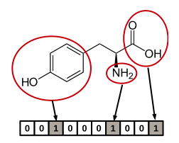

一个10 BIT长度的指纹图谱示意图：每个位置编码一个子结构, 有3个位置所代表的子结构出现在上图的分子中（即被圆圈圈中的那些子结构），这些位置被标为1；其它的位置代表的子结构没有出现在分子中，则被标为0。

基于拓扑或路径的指纹通过分析从一个原子开始直至到达指定数量键的路径（通常为线性）上所有的分子片段，然后对每一个路径中的片段产生指纹。OpenEye的Tree指纹（Tree fingerprint）。

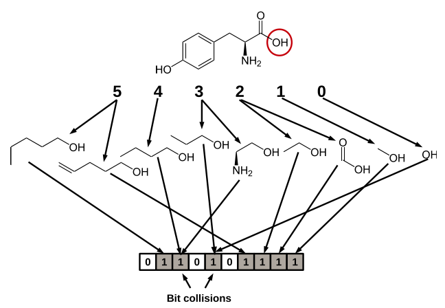

此类指纹适用于任意一个分子，并可以调整其长度，可以用于快速的子结构搜索与分子过滤。

圆形指纹是记录每个从原子出发直到指定半径内的环境。因此，此类指纹不适用于子结构查询（因为相同的片段可能具有不同的环境），但广泛用于完整结构的相似性搜索。如ECEP、FCFP、Molprint2D等。

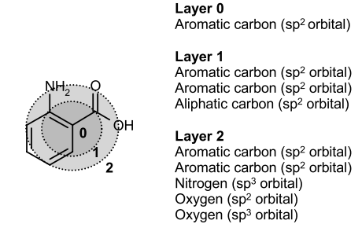

以一个重原子为中心，搜寻在特定半径范围（有的实现用直径）内的结构特征，比如力场的原子类型，官能团，片段等等各种信息。

药效团指纹通常以类似于基于子结构的指纹方式编码分子的结构特征，但同时考虑了这些特征之间的距离，通常按距离范围对其进行分类生成比特位串。比如SYBYL软件包中的Tuplet。

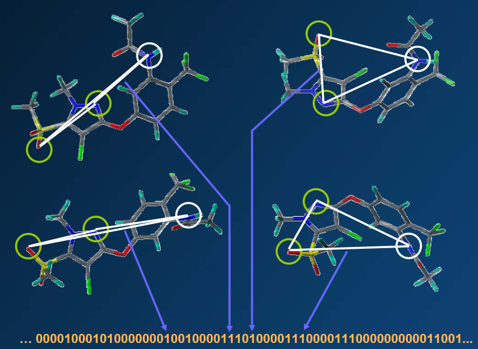

Tuplet药效团指纹图谱示意图：一个分子不同的构象，将每个构象的药效团特征按聚类分类、编码为比特串。

计算分子指纹并用于虚拟筛选的常见软件：

开源、免费：Open Babel、RDKit、CDK、Indigo、jCompoundMapper

商业：OEChem、 TK/OpenEye、JChem/ChemAxon、Canvas/Schrodinger、MOE、Pipeline Pilot、SYBYL‐X

二维（2D）分子指纹方法的特点
::::::::::::::::::::::::::::

采用2D指纹方法进行基于2D相似性的化合物搜索

* 指纹表征的是二进制格式的2D分子结构。
* 不需要生成用于筛选的分子3D构象，通过分子指纹之间的重叠来计算分子之间的结构相似性，2D指纹方法由于其计算效率和有效性而成为基于分子2D相似性筛选的高效方法。
* 指纹方法的有用性也被提出用于骨架跃迁研究。

分子形状相似性的方法
::::::::::::::::::::::::::::

分子形状（Molecular Shape）是药物化学中的基本概念，是分子的3D形状的比对，其基于如果两个分子具有相似的形状，那么它们也可能具有相似的性质的原理。

* 形状相似性通常通过比对方法来评估，该方法寻求两种形状三维重叠的最大化，或者通过特征向量方法，将形状变换成能够有效地比较的特征的低维向量。
* 作为相似性计算的一部分，可以用静电或药效团特征进一步注释分子形状。常见的基于形状的相似性搜索算法有ROCS、Phase Shape等

形状相似性搜索涉及分子比对，分子间以最大化重叠体积或特征点进行比对，以找出两个分子的最佳叠合。

相似性搜索的应用
:::::::::::::::::::::

靶标预测：基于计算的靶标预测方法在药物发现中起重要作用。其中，分子相似性方法作为一种有希望的方法，其基于结构相似的分子往往具有与靶标相似的反应的假设，已成功应用于许多药物相关研究。

基于配体3D形状的结合构象预测：为了提高分子结合构象预测的准确性，研究人员开发了一种使用形状相似度进行构象预测的方法。

分子形状相似性应用于虚拟筛选：形状筛选只需要一个已知活性查询化合物及其构象（最好为药效构象），相对于基于分子对接和药效团的筛选更加节省时间和资源。

参考：Bioorg. Med. Chem. Lett. 25 (2015) 3442–3446

药效团模型 Pharmacophore model
---------------------------------------

药效团的基本概念
::::::::::::::::::::

一个特定受体的药物小分子都具有某种特定的特征结构，换句话说，只要具备这些特征，一个化合物就有可能是这个受体潜在药物分子。这些特征点的集合，我们就称之为药效团。

药效团的由来

* 药物分子与受体靶点发生作用时，要与靶点产生几何匹配和能量匹配，此时药物分子的构象称为活性构象（药效构象）。
* 药物分子中的基团对于活性的影响不同，有些基团的变化对药物与靶点之间的相互作用影响很大，有些则影响不大。
* 对于这种差异的研究，人们发现具有相同活性的分子往往具有相同的某些特征。
* 只要具备这些特征，一个化合物就有可能是这个受体的潜在药物分子。

药效团（Pharmacophore），是指药物分子中可以与受体结合位点形成氢键、静电、疏水等非键相互作用的原子或原子团，及其相互之间的空间关系。具体官能团

IUPAC对药效团的定义：药效团是和特异的靶标结合并引发（或阻断）靶标生物响应所必需的一组立体和电子特征。抽象特征

药效团从结构层面上揭示了药物与受体结合并启动药理活性的微观特征，也就是说，一组活性分子共同呈现特定的药理活性的基础是由于有相同的药效团特征和分布

药效团模型方法

* 药效团模型方法一般包括两个层面的内容：即药效团模型的建立和基于药效团模型的数据库搜索。
* 药效团模型的建立仅仅是得到药效团模型。
* 通过药效团模型，希望能够找到新的先导化合物，这就需要采用基于药效团模型的数据库搜索。
* 通过数据库搜索，来寻找包含特定药效团特征的化合物，这些具有特定药效团特征的化合物可能具有相应的生物活性。

药效特征元素

进行药效团模建的前提是发现和确证配体含有的药效特征元素（药效团特征）

* 典型的药效团特征一般用球体来表示，球心为准确位置，半径为可偏离的范围。具体特征包括：氢键供体、氢键受体、正电中心、负电中心、疏水中心、芳环中心、排除体积、形状约束等。此外，还包括有自定义的其它特征。

氢键供体（hydrogen bond donor）

主要包括H以及与之相连的O和N，一般包括：

* 非酸性羟基（非羧酸或酚类中的羟基）。羧酸、酚类中的羟基之所以显酸性是由于羟基中氧的未成对p电子与苯环、羰基形成p‐π共轭体系，致使氧上电子云密度降低，氢很容易解离。
* 氨基。
* 次氨基，但不包括三氟甲基硫酰胺和四唑中的次氨基。

氢键受体（hydrogen bond accepter）

广义来讲，任何带有孤对电子的原子，如N、O、F、S。在一般的药效团模型方法中，仅考虑药物分子中最常见的氢键受体形式，包括：

* sp3或sp2杂化的O（与C等原子以单键或双键相连的O）
* 与C以双键形式相连的S
* 与C以双键或三键相连的N

氢键的方向性

由于配体与受体之间的氢键相互作用一般具有明确的方向性，因此一般都采用两个点来描述氢键特征，一个点表示氢键特征中重原子的空间位置，而另一个点表示氢键给体或受体的矢量方向。

对于氢键受体，矢量方向一般为重原子和其上孤对电子连线的方向。

对于氢键给体，矢量方向为重原子和与之相连的氢原子形成键的方向。

疏水中心（hydrophobic area）

配体与受体上的疏水基团总是倾向于形成紧密的疏水堆积作用，形成疏水性内核。

* 疏水相互作用本质上包含了熵效应和范德华相互作用。
* 疏水基团一般由非极性原子组成，有疏水相互作用的片段很多，如甲基、乙基、苯环等。
* 在药效团模型方法中，只需要用一个点表示。

芳环中心（aromatic ring）

芳环可以参与药物分子和蛋白受体之间的π电子离域系统的π‐π相互作用。

* 芳环中心主要包括五元和六元芳环，如噻吩、苯环等。
* 芳环需要由两个参量来定义：一个参量是芳环的空间位置，即芳环中所有原子的几何中心；另一个参量是芳环平面矢量方向，一般用垂直于芳环平面的矢量来描述。

电荷中心（charge interaction）

配体上的电荷中心是指配体上的带电基团，由于具有较多的部分电荷，这些基团往往可以和受体形成盐桥或较强的静电吸引作用。

* 电荷中心既可以是带有电荷的原子，也可以是在生理pH下会发生电离的中性基团，如氨基、羧基。
* π电子离域系统，如羧酸盐、胍基、脒基等也可能形成电荷中心。

正电荷中心

* 带正电荷的原子
* 伯、仲、叔脂肪胺中的N原子
* 氮‐氮双取代的脒基中的亚胺N原子或四氮取代的胍基中的亚胺N原子
* 至少含有一个未取代氢原子的脒基中的N原子中心或至少含有一个未取代氢原子的胍基中的N原子中心。

负电荷中心

* 带负电荷的原子
* 三氟甲基磺酰胺中的N原子
* 羧酸、亚磺酸或磷酸中羟基氧和氧代氧的原子中心
* 磷酸二酯和磷酸酯中羟基和氧代氧的原子中心
* 硫酸和磺酸中羟基氧和两个氧代氧的原子中心
* 磷酸单酯和磷酸中氧代氧和两个羟基氧的原子中心
* 四唑中的氨基氮原子

几何约束

药效特征元素可以抽象为点（如：疏水中心、电荷中心）、线（如：氢键）、面（如：芳环）的形式。一个完整的药效团模型中除了必须包含药效特征元素之外，还需要包括药效特征元素之间的空间约束，这些约束是指各特征元素的位置约束，各特征元素之间的距离、角度、取向等。

排除体积（excluded volumes）

* 在配体和受体相互作用时，在配体的某些取代位置上存在某些原子或原子团可能会和受体产生不利的原子碰撞，这些位置上的原子或原子团占有的位置就构成排除体积。
* 在排除体积中存在原子或原子团会大大降低化合物的活性。

药效团模型的应用
:::::::::::::::::::::::

* 虚拟筛选
* 全新药物设计
* 先导物优化
* 多靶点药物设计
* 骨架跃迁
* 靶点预测（反向找靶）

常用的药效团模型构建工具

* Catalyst                                             DS
* DISCO（distance comparison）                         Sybyl
* GASP（genetic algorithm similarity program）         Sybyl
* Phase                                                Schrodinger
* LigandScout
* Pharmacophore in MOE

Discovery studio中的药效团模型
:::::::::::::::::::::::::::::::::

.. table:: 药效团模型

   ============  =======================================
   药效团模型                      药效团模型
   ============  =======================================
   基于配体         HipHop Hypogen
   基于受体         Structure‐based Pharmacophore(SBP)
   基于复合物       Complex‐based Pharmacophore(CBP)
   ============  =======================================

.. image:: /images/146.png

基于配体的药效团模型构建与筛选的基本步骤

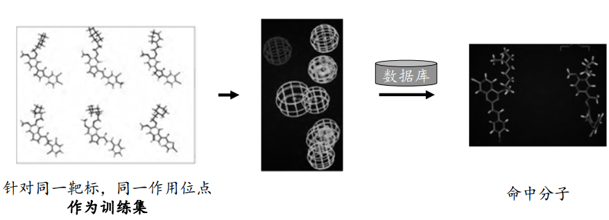

1. 活性化合物的选择及药效特征元素的定义

* 对于用来搭建药效团模型的化合物，其结构刚性要大一些，即分子的构象要少一些，这样叠合得到的药效团模型会较为明确。
* 所选分子应该具有尽量多的结构多样性。如果药效团识别方法只能识别分子公共的药效特征，则选择的分子要具有尽量高的活性。
* 如果药效团识别方法可以根据药效团模型和分子之间的叠合情况对分子的活性进行定量的预测，则选择的分子需要具有准确的生物活性。

2. 构象分析

* 对每个化合物都要进行构象分析，得到在某一能量范围内的构象。
* 这个能量范围一般是根据经验来指定，比如在CATALYST中，默认条件下，构象分析会保留和最低能量构象相差20kcal/mol之内的所有构象。
* 构象分析保留的构象要尽量少一些。
* 在一般的药效团识别软件中，都会对保留的构象数有明确的限制。

3. 分子叠合和药效团映射

* 得到药效团特征元素以及构象以后，就需要对这些构象进行叠合以找到共同的药效团模型。
* 在叠合时，药效特征元素作为分子间叠合的叠合点。
* 分子叠合往往会提供多个药效团，或者说分子存在多种公共的药效特征元素空间分布形式。
* 要想得到较为明确的药效团模型，则要尽量选择结构差别较大的分子。

4. 药效团模型的修正

* 分子叠合得到的药效团往往不是最优的，可能还需要根据自己的经验和其他实验或计算的结果对药效团模型做进一步的修正。比如加入排除体积和形状限制。

基于配体的药效团
^^^^^^^^^^^^^^^^^^^^^^^^

* HipHop：基于分子共同特征的药效团模型。用于发现一系列配体小分子所共有的化学特征，并基于这些共同特性结构的比对叠合自动生成药效团模型，用户可以使用共有的特征药效团去搜索化合物数据库来寻找可能的先导分子

HipHop对于训练集的要求

* 输入的分子结构具有多样性
* 化合物数目值2～32个，6个左右比较理想
* 输入的结构需知活性强弱（强、中、弱）
* 需要包含principal和MaxOmitFeat性质参数

principal和MaxOmitFeat性质参数意义

* Principal 属性定义了分子的活性水平：

.. table:: 

   ====== ========= =========================================================
   数值    活性水平  描述内容
   ====== ========= =========================================================
    2      有活性    参考分子，分子中所有化学特征在构建药效团模型时都要考虑。
    1      中等活性  定位药效团特征元素时需要考虑该化合物的构象空间。
    0      非活性    该分子在定位药效团特征元素时不考虑，用于选择性地定义排除体积。
   ====== ========= =========================================================

* MaxOmitFeat 属性定义了每个分子中允许不与药效团模型匹配的特征元素的个数：

.. table:: 

   ===== ==================================================
   数值      描述内容
   ===== ==================================================
    0      构建的药效团模型中所有特征元素都必需与化合物匹配上。
    1      构建的药效团模型中允许有1 个特征元素不与化合物匹配。
    2      构建的药效团模型中所有特征元素都无需与化合物匹配。
    ‐1     考虑所有药效团特征元素的子集
   ===== ==================================================

* HypoGen：具有活性预测能力的药效团。可以基于一系列针对特定生物靶标具有明确活性数值的化合物构建出具有活性预测能力的药效团模型。该算法首先构建得到活性分子能共享而非活性分子则不能共享的初始药效团模型，然后再经过模拟退火进行模型的进一步优化。最终构建得到的模型可以预测化合物的活性，以及指导化合物的优化以提高其活性。

HypoGen对训练集分子的要求

* 分子结构兼具多样性
* 分子的活性值至少跨越4个数量级
* 每个数量级的活性分子至少3个，化合物总数在16～31个
* 结构类似的化合物之间活性相差至少一个数量级
* 活性相似的化合物之间结构不同
* 需要包含Activ和Uncert性质参数

HypoGen算法流程

1. “构建”步骤

* 识别活性分子
* 识别活性最大的两个分子的所有药效团
* 用活性分子筛选药效团

2. “删除”步骤

* 由“构建”步骤产生的药效团如果出现在大部分非活性分子中，删除

3. 优化步骤

HipHop和HypoGen的区别

.. table:: 

   ================== ========================== ============================
          -               HipHop                         HypoGen
   ================== ========================== ============================
   训练集数量            2～32                         〉16
   训练集是否有活性      全是活性分子                  活性分子与非活性分子
   活性值                不需要                        需要
   模型的类型           定性，只基于公共特征          定量，可预测活性值
   模型的比较           训练集分子结构多样性         训练集分子结构和活性多样性
   药效特征元素的个数    最多10个                     最多5个
   ================== ========================== ============================

基于受体结构的药效团——Structure Based Pharmacophore (SBP)
^^^^^^^^^^^^^^^^^^^^^^^^^^^^^^^^^^^^^^^^^^^^^^^^^^^^^^^^^^^^^^^^^

SBP：基于经典的LUDI算法，从已知或假设的蛋白活性位点的特性直接得到相互作用位点图（feature interaction map），并且将这个信息转化成适用于快速三维数据库检索的药效团模型。

SBP 方法首先通过对活性部位的分析产生特征相互作用图，特征相互作用图用于反映可能的配体与蛋白之间的合理的相互作用，接着通过特征相互作用图产生药效团模型，进一步利用药效团模型发现潜在的活性化合物。

SBP操作流程

1. 导入蛋白结构及定义活性位点
2. 产生相互作用模型及药效团模型
3. 对feature聚类
4. 产生最终模型

Complex Based Pharmacophore (CBP)
^^^^^^^^^^^^^^^^^^^^^^^^^^^^^^^^^^^^^^^^^^

CBP：基于LigandScout算法，通过识别受体‐配体相互作用的关键特性构建药效团模型进行先导物的发现与优化

该类药效团从受体配体间的相互作用出发，能更加准确直接地反应出它们之间的药效团特征

基于CBP的重要应用——反向找靶

一个分子与多个代表各靶标蛋白的药效团模型相互匹配，按照打分高低来判定可能与哪个靶标相互作用

PharmaDB：市场上最大的受体‐配体复合物药效团数据库

* 共25万多个药效团模型
* 基于scPDB中16000多个复合物晶体结构

药效团模型的验证
::::::::::::::::::::::::

药效团模型的好坏直接影响经虚拟筛选后得到的候选化合物质量。为此，有必要进行药效团模型的验证，其目的就是为了评价所构建的药效团模型能否准确的将活性化合物与非活性化合物区分开。目前主要的验证方法有 3 种：

* Fischer’s randomization 验证方法
* 测试集验证方法
* Decoy 验证方法

Fischer’s randomization验证方法是用于检测我们所构建的模型是否具有较好的统计关联。在该方法中，原有训练集中所有化合物与各自的活性关系将会被自动打乱，并进行随机的重新分配，从而组成新的训练集。在参数设置和方法与之前相同的前提下，利用新的训练集构建药效团。统计显著性利用以下公式计算：Significance = 100(1‐(1+x)/y)  其中，x表示随机产生的药效团total cost值低于原始训练集的数目；y表示包括原始药效团在内的所有药效团数目。

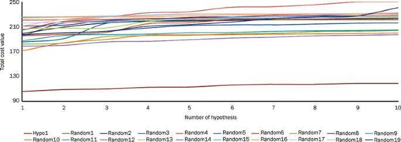

如右图，19组随机得到的药效团模型其total cost值均明显高于初始模型（Hypo1），即说明该模型的统计显著性远远优于其它所有随机得到的药效团模型。

测试集验证：一个成功的药效团不仅要求能准确预测训练集中所有分子的活性，而且还必须具备准确预测训练集以外活性化合物活性的能力。

* 故需要选取一定数量（多于10个），具有一定活性梯度且不存在于训练集中的活性分子组成测试集
* 使用测试集分子预测模型的筛选能力，q^2越接近于1，预测能力越强

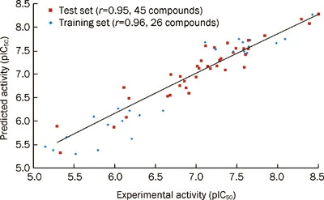

Decoy Set 诱饵分子数据集验证：是指通过已知化合物与非活性化合物建立decoy set，该数据集可验证该药效团模型对于活性化合物和非活性化合物的区分能力。模型筛选性能参数：命中率(hit rate)、富集因子(Enrichment Factor，EF)与ROC曲线(Receiver Operating Characteristic Curve， ROC Curve)

Decoy有一个现成的网站，可直接下载测试文件 http://dude.docking.org/

药效团模型方法vs定量构效关系方法
:::::::::::::::::::::::::::::::::::::::

药效团模型可以基于不同类的化合物，它得到的是与生物活性有关的重要的药效团特征，这组药效团特征是对配体小分子活性特征的抽象与简化，因此药效团模型方法可以用于寻找结构全新的先导化合物。

定量构效关系方法一般是基于母体相似的同系列化合物，它得到的是化合物结构和活性之间的定量关系，这个定量关系一般只能用于先导化合物的改造。

总结
-----

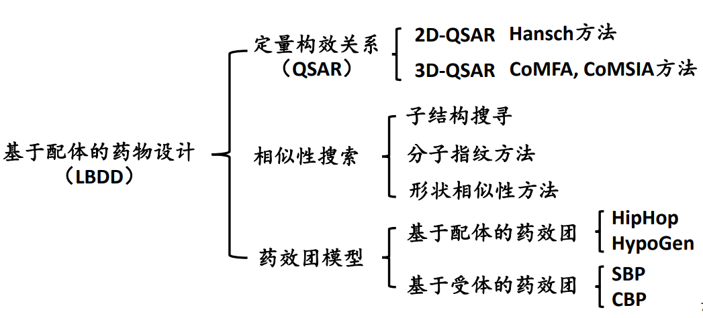

药效团模型的构建和验证实验
-----------------------------

实验目的：
::::::::::::::

1. 掌握基于分子共同特征的药效团模型（HipHop）的构建和验证。
2. 掌握基于复合物的药效团（CBP）模型的构建和结果分析。

实验原理：
::::::::::::::::

使用 Discovery Studio 软件进行基于分子共同特征的药效团模型（HipHop）和基于复合物的药效团（CBP）模型的构建，验证和结果分析。

HipHop：基于分子共同特征的药效团模型。用于发现一系列配体小分子所共有的化学特征，并基于这些共同特性结构的比对叠合自动生成药效团模型，用户可以使用共有的特征药效团去搜索化合物数据库来寻找可能的先导分子。

CBP：基于 LigandScout 算法，通过识别受体‐配体相互作用的关键特性构建药效团模型进行先导物的发现与优化。该类药效团从受体配体间的相互作用出发，能更加准确直接地反应出它们之间的药效团特征。

本实验所用软件环境：

* DS Version：19.1.0.18287
* PP Version：19.1.0.1963
* DS Client Version：19.1.0.18287
* OS Distribution：Windows
* OS Version：10.0.22000

实验步骤：
:::::::::::::

◆ 基于分子共同特征的药效团模型的构建和验证

1. 训练集分子的准备：本实验中使用老师提供的 `5HT2c_ligands.sd 训练集 <https://computer-aided-drug-design.github.io/CADD-Tutorial-Experiments-Result/experiment_results/FeatureMapping_2022_09_26_141920_350/Input/5HT2c_ligands.sd>`_。
2. 药效团特征元素的选取：

   药效特征元素的定义：点击 Discovery Studio 软件上的 Pharmacophores → Edit and Cluster Features → Feature Mapping 进行药效特征元素的定义。设置参数如下图。

   .. image:: images/150.png

   药效特征元素的查看：点击 Discovery Studio 软件上的 Pharmacophores → Edit and Cluster Features → Current Feature → All Features 进行药效特征元素的查看。

3. Common Feature Pharmacophore 的构建：点击 Discovery Studio 软件上的Pharmacophores → Create Pharmacophores Automatically → Common Feature Pharmacophore Generation 进行 Common Feature Pharmacophore 的构建。设置参数如下图，使用老师提供的 `Decoy 数据集 active_ligands <https://computer-aided-drug-design.github.io/CADD-Tutorial-Experiments-Result/experiment_results/CommonFeaturePharmacophoreGeneration_2022_09_26_144258_318/Input/active_ligands.sd>`_ 和 `Decoy 数据集 inactive_ligands <https://computer-aided-drug-design.github.io/CADD-Tutorial-Experiments-Result/experiment_results/CommonFeaturePharmacophoreGeneration_2022_09_26_144258_318/Input/inactive_ligands.sd>`_ 进行药效团验证。

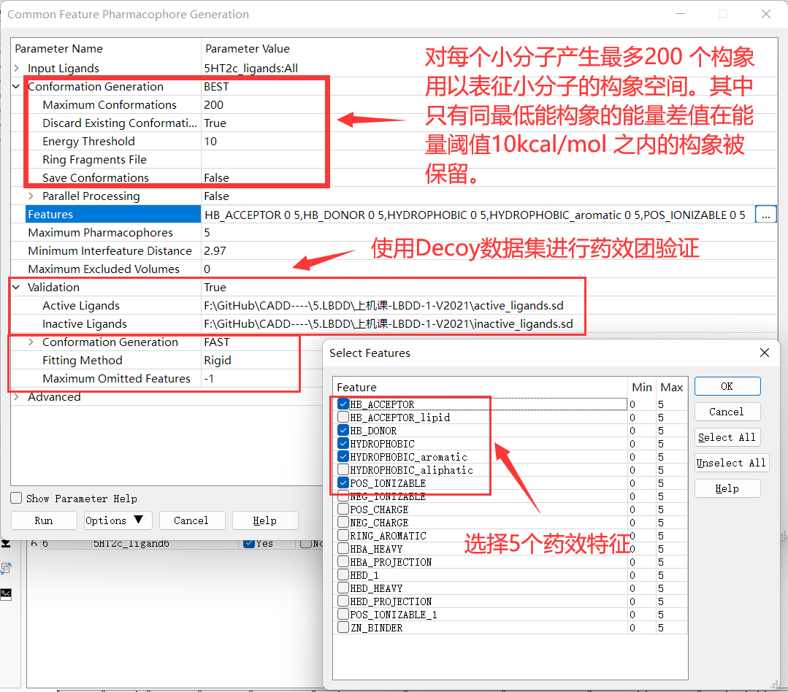

4. 外部测试集分析：合并老师提供的 Decoy 数据集 active_ligands 与 Decoy 数据集 inactive_ligands（也就是复制 Decoy 数据集 active_ligands 中的全部分子，然后粘贴到 Decoy 数据集 inactive_ligands 中，或者直接 `下载已经合并好的文件 <https://computer-aided-drug-design.github.io/CADD-Tutorial-Experiments-Result/experiment_results/LigandProfiler_2022_09_26_222033_205/Input/all_ligands.sd>`_ ），点击 Discovery Studio 软件上的 Pharmacophores → Search, Screen and Profile → Ligand Profile 进行外部测试集的分析，设置参数如下。Input Ligands 选择前面合并的数据集，Input File Pharmacophores 选择之前运行 Common Feature Pharmacophore 构建流程所得到的 Output 文件夹中的所有模型。（按 SHIFT-选取）

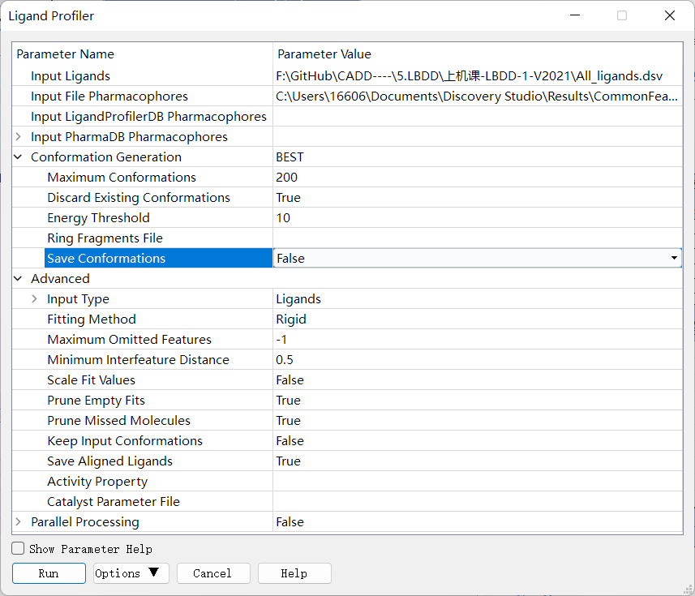

◆ 基于复合物的药效团模型的构建和结果分析

1. 蛋白的准备：本实验中使用老师提供的 `2irz.pdb 蛋白 <https://computer-aided-drug-design.github.io/CADD-Tutorial-Experiments-Result/experiment_results/PrepareProtein_2022_09_27_101028_655/Input/2irz.pdb>`_ 。点击 Discovery Studio 软件上菜单栏上的 Structure→ Crystal Cell→ Remove Cell 进行晶胞的去除。点击Macromolecules → Prepare Protein → Prepare Protein，设置参数如下，来进行蛋白结构的准备得到新窗口 2IRZ_prep 。接下来的操作都是在新的窗口当中进行。

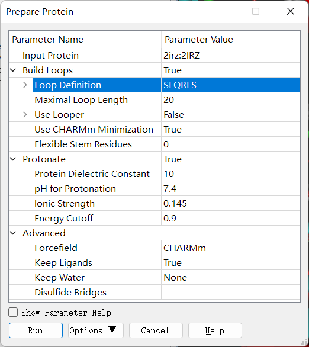

2. 配体的准备：从 2IRZ_prep 窗口中剪切 2IRZ 自带的配体粘贴到新窗口中，并重命名为 Ligand。（重命名的操作：点击选中 2irz 并单击鼠标右键，选择最后一项 Attribute of 2irz...，出现下图对话框，将 Name 改为 Ligand）

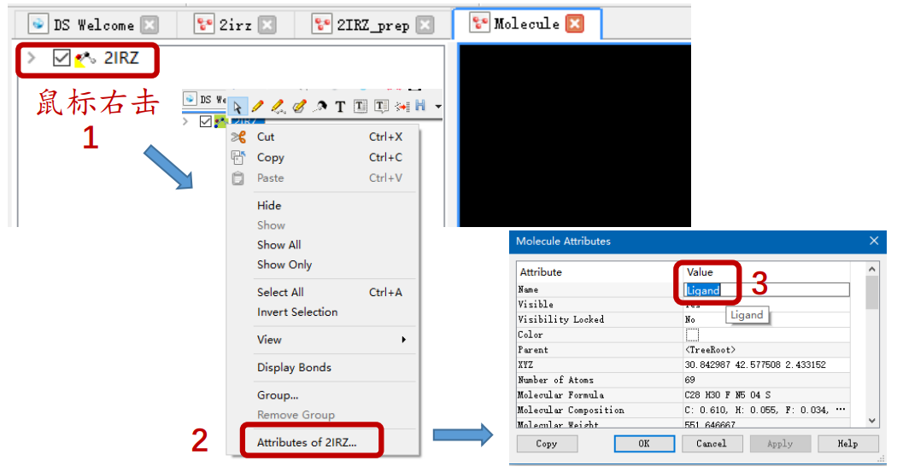

3. 药效团模型的构建：点击 Discovery Studio 软件上的 Pharmacophores → Create Pharmacophores Automatically → Receptor-Ligand Pharmacophore Generation 进行药效团模型的构建，设置参数如下。再把配体小分子再复制粘贴到结果窗口，观察药效团与配体小分子的匹配情况。

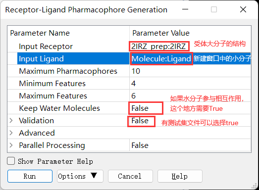

实验结果：
:::::::::::::

基于分子共同特征的药效团模型的构建和验证：

1. `药效特征元素的定义的结果 <https://computer-aided-drug-design.github.io/CADD-Tutorial-Experiments-Result/experiment_results/FeatureMapping_2022_09_26_141920_350/Output/Report.htm>`_
2. `Common Feature Pharmacophore 的构建的结果 <https://computer-aided-drug-design.github.io/CADD-Tutorial-Experiments-Result/experiment_results/CommonFeaturePharmacophoreGeneration_2022_09_26_144258_318/Output/Report.htm>`_
3. `外部测试集分析的结果 <https://computer-aided-drug-design.github.io/CADD-Tutorial-Experiments-Result/experiment_results/LigandProfiler_2022_09_26_222033_205/Output/Report.htm>`_

基于复合物的药效团模型的构建和结果分析：

1. `蛋白的准备 <https://computer-aided-drug-design.github.io/CADD-Tutorial-Experiments-Result/experiment_results/PrepareProtein_2022_09_27_101028_655/Output/Report.htm>`_
2. `药效团模型的构建 <https://computer-aided-drug-design.github.io/CADD-Tutorial-Experiments-Result/experiment_results/Receptor-LigandPharmacophoreGeneration_2022_09_27_102233_541/Output/Report.htm>`_

讨论：
:::::::::::

参与基于分子共同特征的药效团模型的构建的六个分子：

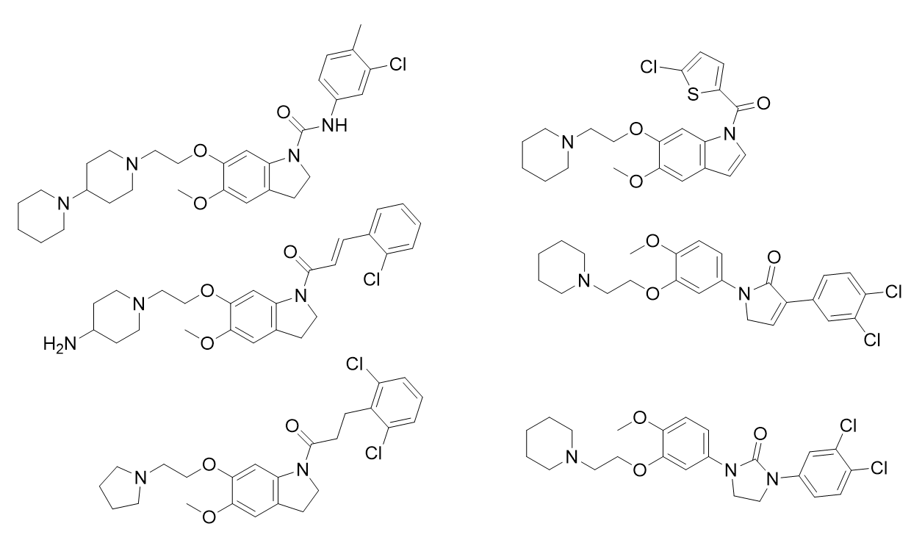

这些分子结构具有多样性，包含principal和MaxOmitFeat性质参数，都有强活性。

从 HipHop 模型验证结果可以看出，HipHop 模型的敏感度很好，但是特异性很差，用于药物筛选时，可能会错误的把无活性的化合物认为潜在的Hit，但是应该不会错过潜在的Hit。其中名为 Pharmacophore_1 的药效团在验证中的表现最好，因为 AUC 值最大。