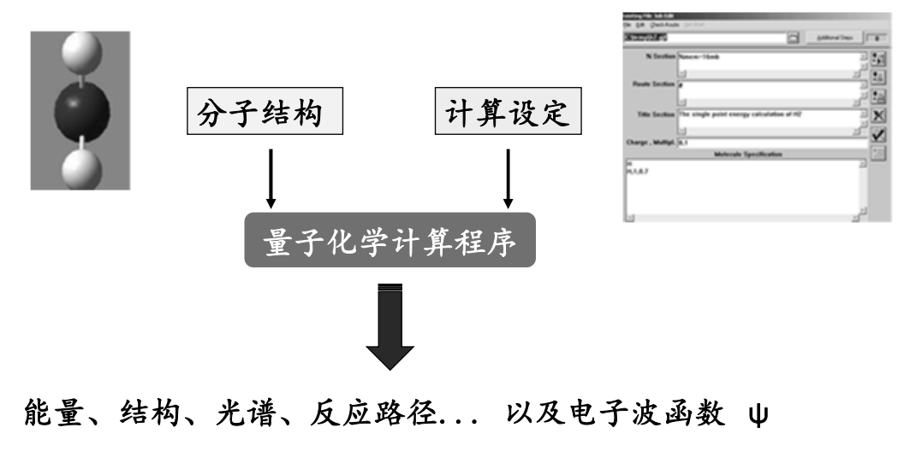
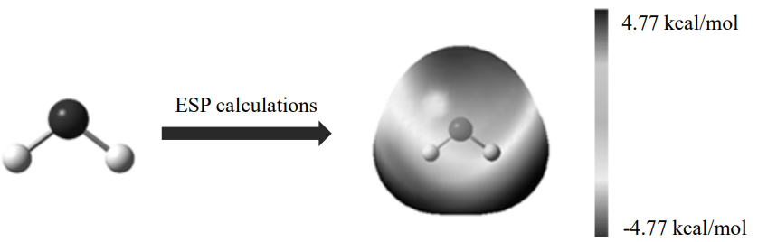
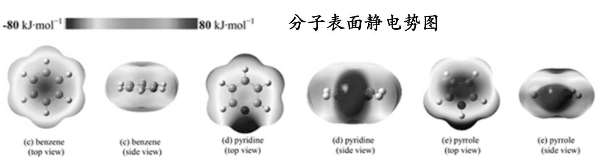
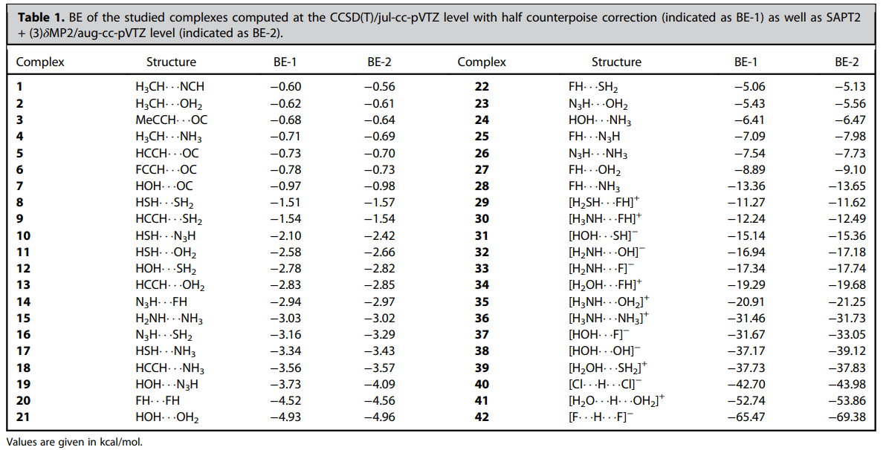
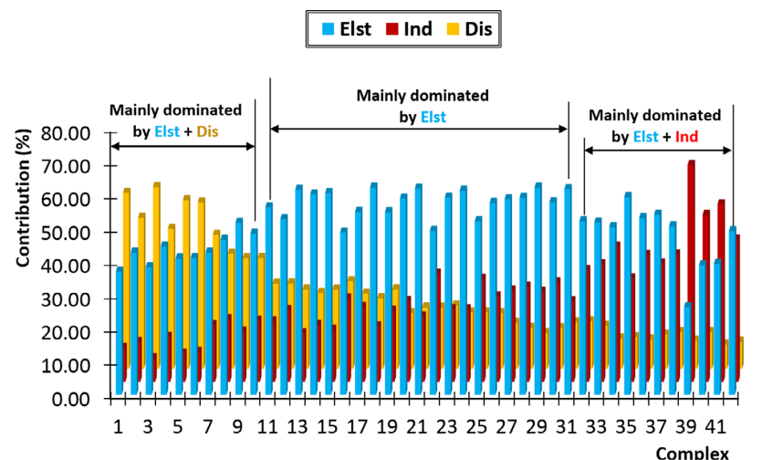
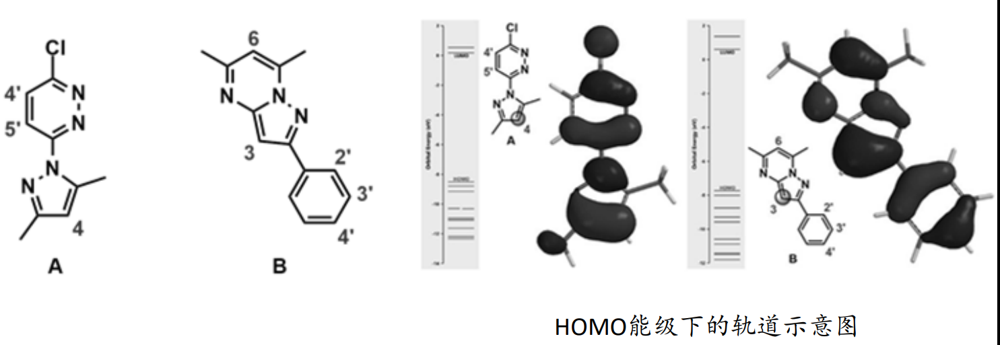
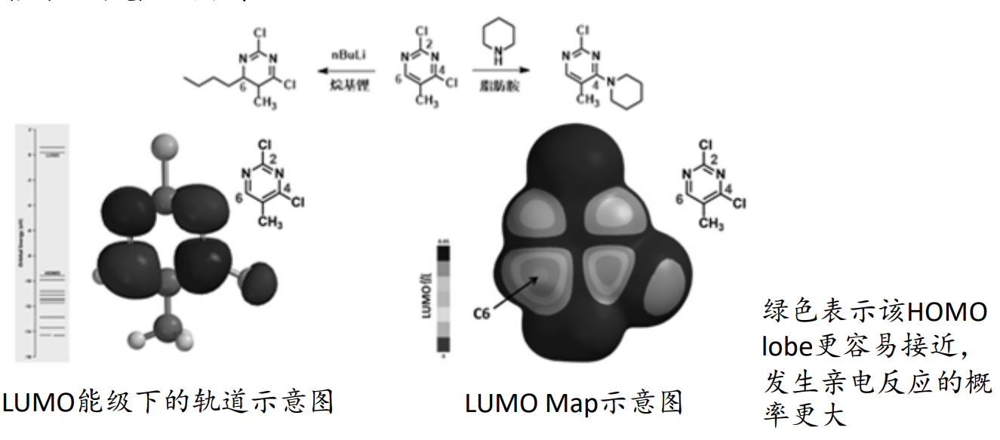
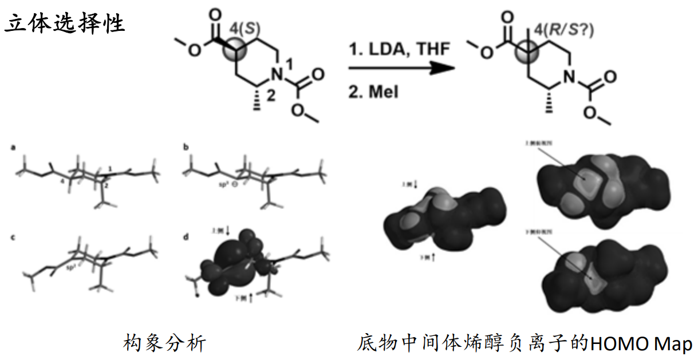
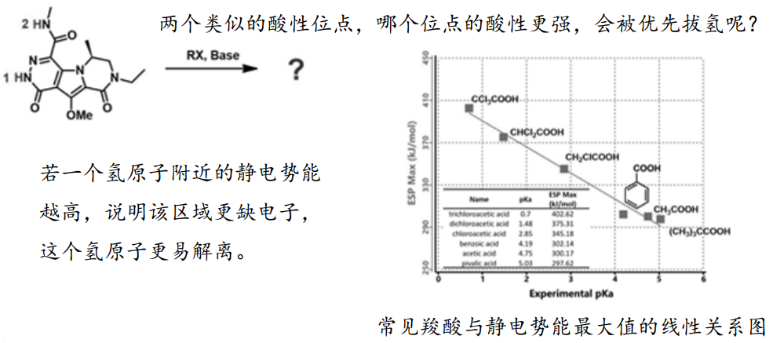
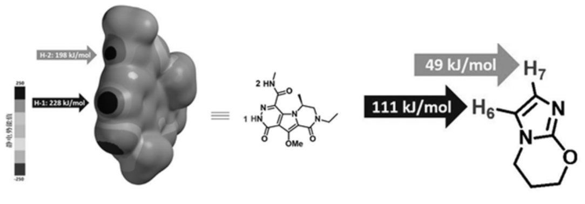

量子力学 (Quantum Mechanics, QM)
==========================================

量子力学基础 Quantum Mechanics Foundation
--------------------------------------------------

1900年Planck提出量子概念，是表现某物质或物理量特性的最小基本单位。

1913年Bohr提出：原子中的电子只能处于包含基态在内的定态上，电子在两个定态之间跃迁而改变它的能量，同时辐射出一定波长的光，光的波长取决于定态之间的能量差——量子论

量子力学：研究微观粒子运动规律的理论。用波函数描写粒子的运动状态，以薛定谔方程确定波函数的变化规律，并对各物理量进行计算。

量子化学：以量子力学的基本原理和方法来研究化学问题的学科。可计算分子的各种参数，如分子结构、成键特征、系统总能量、各个轨道的分子信息、分子间相互作用、各种光谱、振动谱、电磁谱性质和反应过渡态等

量子力学用波函数描写粒子的运动状态，以薛定谔方程(Schrödinger Equation) 确定波函数的变化规律，并对各物理量进行计算。

求解方程主要方法：

* 从头算（Ab initio）
* 密度泛函方法(DFT)
* 半经验计算法(Semi‐imperical)

从头计算法（ab initio methods）：

* 以基本物理常数以及元素的原子序数，不借助于任何经验参数，求解薛定谔方程(Schrödinger Equation)：Ĥψ(r) = E ψ(r)
* 计算结果精度高，可靠性大，但是计算量极大，消耗计算机时太多
* 从头计算方法包括Hartree‐Fork、微扰、耦合簇、组态相互作用等

密度泛函方法（Density Function Theory, DFT）：

* 用电子密度取代波函数做为研究的基本量，其将电子能量分为几个部分，动能、电子‐核相互作用、库仑排斥，以及其余部分的交换相关项，所有项只是电子密度的函数。
* DFT方法之所以计算效率更高，是因为它使用一个单变量积分来代替双电子的Coulomb积分以及用一个交换‐相关泛函(VXC) 来代替双电子的电子交换‐耦合积分。

1994年，最重要的一种交换‐相关泛函B3LYP被提出后，DFT就日趋流行，B3LYP几乎成为了计算各种问题的默认方法。在此之后比较重要的发展有以下这些：

* 以DFT‐D为代表的色散校正方法：解决B3LYP、PBE等传统泛函难以或完全不能描述色散作用的问题。
* 双杂化泛函：将MP2的二阶校正引入交换‐相关泛函。精读比普通泛函高一个级别，但计算量也高一个级别。

半经验计算法（semiempirical methods）

采用实验值拟合的经验参数，使薛定谔方程得到简化后再求解，提高计算速度

* 但计算精度较差，造成结构差异较大的体系进行性质比较时可靠性不高
* 可用于处理较大分子
* 半经验计算法的软件有：MOPAC和AMPAC等

量子化学计算的优缺点

优点：可计算出分子的理化参数、分子结构的电子结构，几何构型和易与亲电试剂或亲核试剂反应的部位

缺点：只适用于计算分子量较小分子，计算时间长

量子化学计算的常规流程：

常用的量子化学计算软件:

以计算原理分：

基于从头算或第一性原理方法：Gaussian、ORCA、PSI4、ADF、Dalton、Gamess、Crystal、VASP、Jaguar、Dmol3等

基于半经验或分子力学方法：MOPAC、EHMO、Hyperchem等

以研究对象分：

有限尺度体系(分子、簇合物等)：Gaussian、ORCA、PSI4、Jaguar、ADF、Dalton、Gamess、MOPAC、EHMO等

无限周期重复体系(晶体、固体表面、链状聚合物等)：Crystal、NNEW3、VASP、Wien、Dmol3等

“量子化学已经发展成为广大化学家使用的工具，将化学带入了一个新的时代。在这个新时代里，实验和理论能够共同协力探讨分子体系的性质。化学因此不再是单纯的实验科学了。”        ——1998年瑞典皇家科学院诺贝尔化学奖发布公告

量子化学计算在药物化学研究中的应用 The Application of Quantum Chemistry in Medicinal Chemistry
-------------------------------------------------------------------------------------------------------

1. 量子化学参数与定量构效关系

量子化学描述符可以成为定量构效关系的描述符，比如：总能量(Et)、电离能(Ee)、分子生成热(Ef)、前线轨道能量HOMO和LUMO等能量参数，酯水分配系数(LogP)、偶极距(Dipo)、分子极化率(a)、摩尔折射率(MR)、分子量(w)、分子范德华体积(y)和一些电性参数等

2. 分子力场参数的来源之一
3. 分子中各原子的部分电荷（partial charge）：主要用于分子模拟中，描述静电相互作用

4. 分子静电势（Electrostatic potential, ESP）

物理定义：空间某点的静电势是指从无穷远处移动单位正电荷至该点时所需做的功，换句话说，静电势实质上是静电相互作用力存在的根源之一。简单地讲，如果不考虑其他因素，当分子周围空间某一点静电势为正值时，意味着这一点对正电荷是排斥的；相反，如果某一点静电势为负值时，则意味着这一点对正电荷是吸引的。由于分子间的静电相互作用力是分子间主要远程相互作用，因此，静电势对于考察分子间静电相互作用、预测反应位点、预测分子性质等方面有重要意义，被广为使用。

表面静电势：不同表面区域静电势大小通过不同颜色展现，使分子表面上静电势的分布一目了然。分子表面一般都用Bader定义的范德华表面，即电子密度为0.001 e/Bohr^3的等值面。

静电势为负值——即带正电荷的微粒与其有较强的相互作用，容易与之靠近；相反，带负电荷的微粒则容易与H靠拢。据此，可对分子反应部位、分子间相互作用和分子识别做出初步判断。

5. 弱相互作用分析

参考：doi:10.1002/jcc.26068 

为了揭示氢键本质、讨论如何估计氢键强度，此文首先构造了一批氢键二聚体

对上述42个氢键二聚体分别给出了结合能当中的静电作用(Elst)、色散作用(Dis)、诱导(Ind)、交换互斥(Rep)部分各自的贡献，其中前三项对于氢键的形成起到正贡献

6. 分子扭转能/内能（Strain Energy）

小分子构象:

* 低能构象/优势构象
* 活性构象/药效构象

配体分子与靶点结合的构象变化：从溶剂非结合构象系综变为到生物活性构象。

参考：doi:10.1021/acs.jmedchem.9b01720 

量子化学计算在药物合成中的应用 The Application of Quantum Chemistry in Drug Synthesis
-------------------------------------------------------------------------------------------

1. 前线轨道理论的应用

在亲电反应中，亲电试剂会进攻底物上HOMO值最大的地方，即电子能量最活泼的原子；相反，在亲核反应中，亲核试剂会进攻底物上LUMO值最小的，即可以接受电子的原子。

在前线轨道理论（Frontier Molecular Orbital）中，化学反应的发生，是因为两个反应物之间的最高占有轨道HOMO (Highest Occupied Molecular Orbital)和最低未占轨道LUMO (Lowest Unoccupied Molecular Orbital) 相互吸引，进而发生电子转移，导致反应发生。

预测卤代反应的位点

预测亲核取代反应的位点

立体选择性

2. 静电势的应用

质子酸性预测

静电势能图是将分子各个位点的静电势能映射到分子形状表面

3. 混合的量子力学/分子力学（QM/MM）方法

分子力学（MM）：计算精度不高、无法考虑化学反应

量子力学（QM）：计算量大、能处理体系小

量子力学/分子力学（QM/MM）联用应用：复合物结构优化，酶催化反应研究等。

