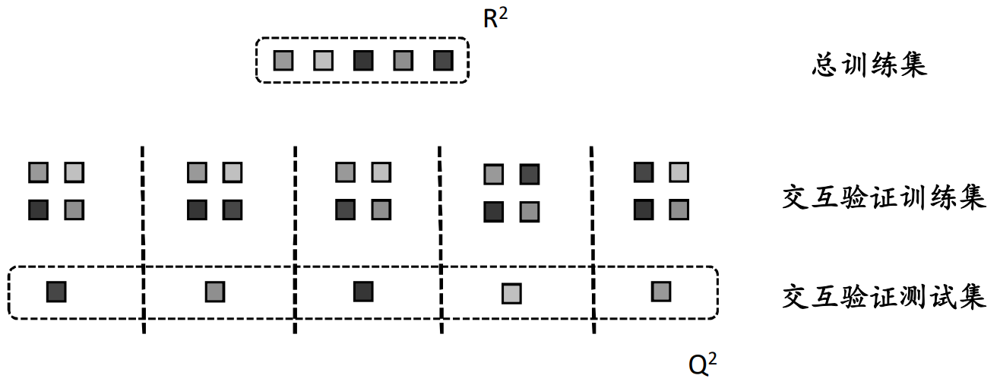

定量构效关系（Quantitative Structure-Activity Relationships）(QSAR)
======================================================================

构效关系（Structure-Activity Relationship）的弊端：

* 非定量
* 过于经验化，难以标准化
* 需要大量的化合物样本和实验数据
* 难以预测新化合物的活性

概念（concept）
------------------

定量构效关系（quantitative structure-activity relationships，QSAR），是研究一组化合物的活性、毒性、药代性质与其结构（structural）、物理化学性质（physicochemical）、拓扑结构（topological）等之间的相关关系，并用数理统计模型加以表征的研究方法。

QSAR的发展简史
------------------

1863年，法国斯特拉斯堡大学Cros博士的论文提到哺乳动物体内醇类毒性会随着其水溶性的降低而增加，并可以达到一个最大值。这是关于分子结构和生物活性之间关系的最早文献报道

1868年，英国药理学家Fraser和化学家Crum Brown在研究生物碱的碱性N原子甲基化前后的生物效应时，提出化合物的生理活性依赖于其组分的变化，即生物活性Φ是化合物组成C的函数：  :math:`Φ＝f(C)` 这就是著名的Crum-Brown方程。

二十世纪30年代Hammett研究了有机物毒性与分子电性（σ）之间的关系，提出芳香环上取代基的电性效应可表示为 :math:`σ=log(K_x/K_H)`，其中 :math:`K_H` 和 :math:`K_x` 分别表示苯甲酸和相应的取代苯甲酸在25摄氏度水溶液中的电离常数，而且认为化合物的毒性或麻醉作用与溶解度相关。

二十世纪50年代Taft提出立体参数的概念，把Hammett的思想扩展到脂肪族化合物，指出 :math:`E_s=log(K_s/K_H)`，其中 :math:`K_s` 和 :math:`K_H` 分别表示酰基上取代的乙酸甲脂的酸水解反应速率常数和乙酸甲脂的酸水解速率常数，即分子体系的空间效应可决定化合物的水解速率常数。

经典的QSAR模型：Hansch模型 1964年，Hansch和Fujita（藤田）指出，分子的生物活性主要是由其疏水效应（:math:`logP`）、立体效应（ :math:`E_s`）和静电效应（ :math:`σ`）决定的，并且假设这三种效应彼此可以独立相加，据此提出Hansch模型： :math:`log(1/C) = a logP + b E_s + ρ σ + d`。Hansch模型揭开了经典QSAR研究的篇章，成为QSAR发展历史中的里程碑。 Hansch模型的提出标志着药物定量构效关系研究的开始，也被认为是从盲目药物设计过渡到合理药物设计的重要标志。

QSAR的意义：在受体结构未知的情况下，揭示化合物的结构与活性的依赖关系，建立表征这种关系的数学模型，以预测未知化合物的活性，演绎受体与药物相互作用关系。

QSAR建模的基本要求：2002年在葡萄牙的Setubal召开的一次国际会议上，与会的科学工作者们提出了关于QSAR模型有效性的几条规则，被称为“Setubal Principles”，这些规则在 2004年11月得到了进一步详细的修正，并被正式命名为“OECD Principles”。规定一个QSAR模型要达到调控目的（regulatory purpose），必须满足以下5个条件：

  1) a defined endpoint（明确目标）
  2) an unambiguous algorithm（明确算法）
  3) a defined domain of applicability（明确的使用范围）
  4) appropriate measures of goodness-of-fit, robustness and predictivity（稳定）
  5) a mechanistic interpretation, if possible（可解释）

实际上这五个条件已经全面概括了QSAR研究工作的基本要求。

QSAR的分类：

根据配体分子属性：

1. 二维定量构效关系（2D-QSAR）
2. 三维定量构效关系（3D-QSAR）
3. 混合型定量构效关系（XD-QSAR）

二维定量构效关系（2D-QSAR）
-----------------------------------------

二维定量构效关系方法（2D-QSAR）是将分子整体的结构性质作为参数（不考虑分子三维结构），对分子生理活性（活性、毒性、药代性质等）进行回归分析，并量化其化学结构与生理活性相关关系

经典的二维定量构效关系方法包括Hansch法、Free-Wilson法等，以 Hansch法最为著名

根据用途不同可分为：QSAR、QSTR（toxicity）、QSPR（pharmacokinetics）等（QSXR）

特点：不考虑分子三维构象、无需优化、无需叠合、计算效率高

2D-QSAR的一般步骤
::::::::::::::::::::::::::::::::::

数据采集 --> 数据处理 --> 模型构建 --> 外部检测

Paper Database --> Descriptor calculation and selection --> MLR/PLS cross-validation --> External testing

QSAR的数据组成：化学结构特征数据和生物活性表征数据

化学结构特征数据（分子描述符）又称分子描述符（molecular descriptor），是描述分子结构属性的变量，其可以是物理化学参数、图形拓扑结构参数等。分子描述符在QSAR模型的构建中通常作为自变量出现，其可以由实验测得或计算获得。化学描述变量由组成性描述符，理化参数描述符、分子片断、连接描述符和其它参数构成。

组成性描述符：分子量，各类原子数目，芳香环数目，氢键供体、受体数，可旋转键数

理化参数描述符：疏水性参数（Lipophilicity Parameters），电性参数（Electronic Parameters），立体参数（Steric Parameters）

疏水性：非极性溶质与水混合时会形成互不相溶的两相，即非极性分子有离开水相进入非极性相的趋势，即所谓的疏水性（Hydrophobicity），所产生的效应称为疏水效应（Hydrophobic effect）

疏水性在药物的吸收、转运、药物-靶标相互作用以及药代动力学中都有十分重要的作用

由于疏水效应与溶质在溶剂中的分配比例有关，因此常用疏水常数或脂水分配系数（LogP）来表示，疏水常数在QSAR研究中是一个重要参数

疏水性参数（Lipophilicity Parameters）：脂水分配系数（ logP ），正辛醇/水分配系数 :math:`logP = log(\frac{C_o}{C_w})`。P值越高，疏水性（hydrophobic）越强。P值越低，亲水性（hydrophilic）越强。

    Lipinski Rule of Five（类药五原则）又称五倍率规则，其可解释约70%上市药物

    * 化合物的分子量不大于500道尔顿
    * 化合物中氢键供体（包括羟基、氨基等）数量不大于5个
    * 化合物中氢键受体的数量不大于10个
    * 化合物的脂水分配系数的对数值（logP）不大于5
    * 化合物中可旋转键的数量不大于10个

五倍率成药规则揭示大部分成功药物不会有太大亲脂性（logP<5），其原因在于：
* 脂溶性过大的化合物容易与血浆蛋白结合成大分子，不易透过生物膜，从而降低了其分配特性
* 脂溶性过大易造成药物在脂肪组织中的堆积，从而产生蓄积毒性
* 适当的调节LogP，可以有效改变药物半衰期，从而改变给药剂量和给药半衰期

LogP的理论预测方法：在QSAR研究中，尽管分配系数的实验值较计算值更有价值，但对于没有实验值或很难用实验法来测定的化合物，可靠的估算方法变得十分必要。

预测方法包括碎片加合法和基于分子性质的计算方法

碎片加合法：碎片加合法的基础是假定分子的疏水常数具有加合性。把分子划分为基本片段，每种特定的基本片段具有特定的贡献值，整个分子的logP值是其所含的所有片段贡献的总和。片段的贡献值为取代基疏水常数（substituent hydrophobic constant），用 π 表示，可经计算获得，亦可通过查表获得。碎片加合法的优势在于其概念清楚，计算快捷，结果精度较高，适用范围广，因此是目前应用最广泛的方法。

基于分子性质的计算方法：

分子表面积法：耶洛夫斯基（Yalkowsky）最早报道了分子的表面积与logP的关系。

分子极性表面（Polar Surface Area， PSA）：极性原子以及与之相连氢原子的表面积加和

PSA广泛用于吸收或扩散性质的预测

电性参数（Electronic Parameters）

Hammett电性常数（𝝈）：芳香环间位或对位上侧链取代基对分子反应性的影响（表示芳香取代基的诱导和共轭效应之和），用参数𝝈表示，正值表示为吸电子基，负值表示为推电子基。 :math:`σ=log(K_x/K_H)`  :math:`K_H`， :math:`K_x` ：苯甲酸和相应的取代苯甲酸在25摄氏度水溶液中的电离常数。值的正负可以反映基团吸电子或给电子能力。值的大小可以反映反应能力的强弱。

立体参数（Steric Parameters）

Taft立体参数（:math:`E_s`）：取代基团的大小对酸性介质中脂肪族化合物水解速率的影响，其值均≤0（氢为最小基团）。 :math:`E_s=log(K_s/K_H)` 其中: :math:`K_H` =乙酸甲脂的酸水解速率常数。:math:`K_s` =酰基上取代的乙酸甲脂的酸水解反应速率常数。取代基越大，水解速率越慢，:math:`E_s` 越负。氢的 :math:`E_s` 值最大，为零。

    .. image::  /images/53.png

    :math:`-CCl_3`  :math:`E_s` =-2.06
        
    :math:`-CF_3`  :math:`E_s` =-1.16

分子片断描述符：分子片断描述符将分子中某一特征片断，如原子片断、环片断以及亚结构片断作为描述符代码，是一种拓扑学范畴的描述符。

由于分子片断描述符仅考虑彼此独立的分子片断，而可能丢失分子结构内部各基团的排列位置与相互联系的信息，因此产生了分子连接指数描述符

分子连接性指数：分子连接性指数反应了分子中各原子排列状况、分支大小，其与多种理化常数及生物活性相关

分子片段组成和分子片段连接关系进一步拓展构成分子片段与连接描述符，即分子指纹（molecular fingerprint）

其它参数：此外还有位置描述符、环境描述符、几何描述符等，有时为了尽可能地减少信息损失，可同时并用几种描述符。

活性数据又可称为应变量，由实验测定，可以是连续的如“y=pC”，也可以是离散的如“活性-非活性”、“弱-中-强”等。在QSAR中，应变量活性参数通常以产生标准生物效应时药物的物质的量剂量或物质的量浓度的负对数（log1/C）表示。

药物的生物活性定义为产生预定的生物效应时所需剂量或浓度：

* 半数有效量EC/D_50：产生最大生物效应一半时的浓度/剂量（effective）
* 半数致死率LD_50：一半死亡时的剂量（lethal）
* 抑制活性IC_50：活性被抑制50%时抑制剂的浓度（inhibitory）
* 全抑制浓度MIC：完全抑制所需最低浓度（最低抑制浓度，minimum）
  
对生物活性数据的要求：

* 准确
* 有代表性
* 同源
* 数量尽可能多

QSAR的建模（分析）方法

目前，几乎所有探索化合物结构-活性关系的分析方法都是以统计学为基础的。进行QSAR数据分析，最常采用的建模种类包括：根据用途分为：回归分析和分类分析（模式判别）。根据算法分为：线性方法和非线性方法。此类方法均属于化学计量学（Chemometrics）范畴。

建立模型的方法是影响 QSAR模型质量的关键因素。目前最常用的建模方法：线性方法包括多元线性回归，主成分回归，偏最小二乘法。非线性方法包括人工神经网络，支持向量机，朴素贝叶斯。线性方法通常适用于回归分析，但很少用于分类分析。非线性方法通常适用于回归与分类分析，一般认为非线性方法是人工智能的基础。

线性回归分析是指对一组数据进行最小二乘拟合并建立函数关系的过程。当有几种性质可能对活性有贡献时，可用多元线性回归来处理。事实上，因变量只受一个自变量影响的情况非常少见，通常由几个自变量共同影响一个因变量。

在QSAR建模中，经典的多元线性方法包括Hansch分析法和Free-Wilson分析法，其可用于同源先导化合物活性的优化和预测，分析药物作用机制，推测受体模型结构等。其最大优点是可获得物理意义明确的因果模型。

回归模型评判方式：:math:`R^2` 和S

有很多内部检验的方法可以用来评估一个模型的拟合能力、稳定性和内部预测能力，如相关系数（决定系数）、交互检验以及各种残差分析（均方根误差、标准偏差等）。

相关系数(R) :math:`R = \sqrt{1-\frac{\sum (y_{pred}-y_{exp})^2}{\sum (y_{exp}-y_{mean})^2}}` R越高，s越小，表明模型的拟合能力越强。

标准偏差(s) :math:`s = \sqrt{\frac{\sum (y_{pred}-y_{exp})^2}{n-k-1}}` 其中 :math:`n ≥ 5k`, n为样本数，k为自变量数目（分子描述符数目）

R值注意问题：

* 虽然R是衡量总回归效果的重要标志，但是R值的大小与回归方程中因变量个数n（样本数量）以及自变量个数k（分子描述符数量）有关。
* 当n相对于k不大时，会获得较大的R值，即容易产生偶然相关（过拟合， overfitting），特别是当n=k+1时，即使k个自变量与因变量Y完全不相关，亦有R=1的结果。
* 因此进行多元线性回归时要注意n与k的比例。一般认为，参与回归分析的化合物数目n与所得到的关系式中参数项数目k（即分子描述符个数）之比应不小于5:1（至少4:1）

分子描述符取舍原则:若交叉相关系数>0.9，说明两参数高度相关，即回归方程中保留一个即可，对两个条件相似参数可删除与目标值相关性小的参数。

模型检验
------------

内部验证（交互验证）（cross validation）：

* Leave-One-Out (LOO)
* Leave-Many-Out (LMO) 
* Bootstrapping

最常用交互检验方法：留一法（Leave-One-Out, LOO）

交互检验：依次从N个样本中抽出1个样本，用剩下的N-1个样本来建立构效关系模型，然后用建立的模型预测抽取出来的1个样本的活性，重复这个操作，直到所有样本都被抽去和预测。然后计算内部测试集预测误差的平方和（PRESS）和交互检验相关系数（QLOO）

.. math:: 
  PRESS=\sum{(y_{pred}-y_{exp})^2} 
  
.. math:: 
  Q_{LOO} = \sqrt{1-\frac{PRESS}{\sum{(y_{exp}-y_{mean})^2}}}

外部验证

外部测试集（test set）预测：从研究的化合物中挑选出足够多的样本组成预测集，预测集中的样本不参加模型的构建，然后通过模型对预测集中的分子的预测结果来检验模型真实的预测能力（Rtest）。

QSAR模型构建的注意事项：

* 模型应用范围：定量构效关系的研究只能应用于作用机制相同的同源化合物，一般认为，结构相近的同源物，其在体内作用机制相同
* 实验数据选择：当一组同源物的生物活性变化幅度若小于一个对数单位（即小于10倍）时，往往难以得到满意的相关结果，这是由相关系数（R）的计算方法决定的
* 模型可靠性判断条件：一般认为，当 :math:`R^2>0.8` 或 :math:`Q^2>0.5` 时，模型具有较好预测能力；模型外部测试结果（Rtest）应与内部交互验证结果（Q）相当
* 模型样本调整：在进行回归分析计算中，若有偏离较大的化合物需剔除时，剔除的数据点不能过多，以避免过多人为因素干扰。对于被去除的数据点应给予合理的解释

定量构效关系不能代替传统药物设计，其不能发现全新结构先导化合物。这一方面工作可以通过基于结构的药物设计进行（如分子对接）

在预测生物活性方面并不总是成功的，这是因为所得到的定量关系式不能完全解释化合物与受体间作用，即简单的理化参数不足以完全描述化合物生物活性的本质

QSAR的应用:

* 预测同源物的生物活性：由一组同源物所得到的QSAR模型可用来预测同系物生物活性。对于作用机制相同的同源物，定量构效关系的研究常可得到满意的结果。对于作用机制不同的化合物，其QSAR模型表达形式往往不同，因此不能随意外推到其他类型的分子
* 避免合成过多的化合物：在化合物的设计方面，比较常见的系列化合物为同系物，如甲基、乙基、丙基、丁基等。这样的同系物对于探索哪种理化参数对生物活性有显著的影响方面只能获得少量的信息，因此对指导进一步的化合物设计帮助不大
* 更有目的地提高化合物的选择性：对一系列同源物的两种不同活性（如：亚型选择性）分别进行定量构效关系的研究，往往可以得到不同的关系式，根据不同的关系式所提供的差异性信息可有目的地提高化合物的选择性
* 预测化合物的成药性质：化合物在体内的ADMET性质与其结构的关系不像配体-受体结合时关系那样紧密，因此，许多针对药物药效学而开发的方法难以适用。研究表明，药物结构的某些描述符与其ADMET性质存在定量关系，其可起到预测的作用。QSPR研究，有针对性地改造化合物的结构以期改进药动学性质。QSTR研究，改善分子的毒性。
* 协助理解药物的作用机制：化合物结构的基本骨架必须与受体相适应才能发挥生理作用。取代基团的改变可显著影响化合物与受体的结合。研究表明，取代基是通过疏水性、电性和立体效应等因素来影晌化合物与受体相互作用的。定量构效关系的研究，如Hansch法，可定量描述化合物理化参数与生物活性关系，因而起到协助了解药物作用机制的作用。

三维定量构效关系
-------------------

3D-QSAR是引入分子三维结构信息进行定量构效关系研究的方法，这种方法可间接反映药物分子与生物大分子相互作用中两者间非键相互作用特征，相对于二维定量构效关系有更加明确的物理意义和更丰富的信息量。1980年以来，三维定量构效关系也逐渐成为基于机理的合理药物设计的主要方法之一。

3D-QSAR分析方法：3D-QSAR是QSAR与计算化学和分子图形学相结合的研究方法，是研究药物与受体间的相互作用、推测模拟受体结构、建立药效-结构活性关系，并进行药物分子优化的有力工具。常用的3D-QSAR包括：分子形状分析（Molecular Shape Analysis，MSA）。假想受点点阵（Hypothetical Active Site Lattice，HASL）。距离几何法（Distance Geometry Methods，DGM）。比较分子场分析（Comparative Molecular Field Analysis，CoMFA）。比较分子相似性因子分析（Comparative Molecular Similarity Indices Analysis，CoMSIA）。

比较分子场分析（CoMFA）

由Cramer于1988年提出，其指出：引起生物学效应的药物分子与受体间相互作用大多是可逆的非键相互作用，如范德华相互作用、静电相互作用、氢键相互作用等，并称这些相互作用为分子场。因此，在受体三维结构不明确的情况下，可以通过研究这些药物分子周围的作用势场的分布情况，并以此作为化合物的结构特征变量，建立其与化合物活性之间的关系，定量预测新设计化合物生物活性。CoMFA的提出是QSAR研究领域中的一项重大突破

按照CoMFA原理，如果一组结构类似的化合物以相同方式作用于同一靶点，那它们与受体分子之间的各种作用场应具有一定相似性，而其活性差异取决于化合物周围不同的分子场。

3D-QSAR建模的主要步骤
--------------------------

Processes for developing a CoMFA model:

* Preparation of the data（数据准备）
* Optimization and overlap of the 3D structures（分子优化与叠合）
* Calculation of molecular fields（分子场计算）
* Model training with cross validation（模型训练）
* Validating the prediction capability with the test set（外部检测）

Training set -> Geometry optimization -> Descriptor Calculations -> Model Development

Test set -> Geometry optimization -> Descriptor Calculations -> Model Validation

CoMFA操作基本过程

1. 分子结构处理，确定活性构象（药效构象）：当有受体的晶体结构或受体与小分子的作用位点信息清楚的情况下，可采用分子对接的方法确定分子的活性构象
2. 计算分子中的原子电荷：获取原子净电荷以便能计算分子的静电场
3. 分子叠合（关键步骤）：叠合一般分为骨架叠合和场叠合。对于结构差异较大的化合物，叠合规则的选取对研究结果影响显著
    
   骨架叠合规则：

   1. 在了解作用机理的前提下，可用已知活性构象为模板，优化、叠合其他分子
   2. 在活性构象未知的情况下，用活性最高分子的低能构象作为模板，优化、叠合其他分子
   3. 亦可依据活性类似法（Active Analogue Approach，AAA）对所有分子进行系统构象搜索，找出其共同构象，从而确立活性构象进行叠合

4. 分子场计算：在叠合的分子周围产生一个包容所有分子的矩形盒子，并划分成规则排
列的格点。用某种基团或小分子作为探针（ :math:`H^+`、:math:`Csp^{3+}`、:math:`H_2O`、:math:`CH_3` 等），在网格中以一定的步长移动（0.4~2 Å），计算分子在格点中的各种分子场，用以作为QSAR建模时的自变量

  常用的探针有：
    * :math:`Csp^{3+}` — 计算立体能和静电能 
    * :math:`H_2O` — 计算疏水场和氢键 
    * :math:`CH_3` — 计算van der Waals场 
    * :math:`H^+` — 计算静电场

5. 模型构建：由于分子场格点较多（往往采集到>2000个分子场值），其通常远超化合物数量，因此不能采用多元线性回归法构建模型，而需采用偏最小二乘法（Partial Least Squares，PLS），以克服自变量数目过多所引起的随机相关问题。模型精度评价亦采用交互验证系数Q，当Q^2>0.5时表示模型具有较好精度。
6. 外部检测并利用模型预测新设计化合物活性
7. CoMFA模型的可视化：CoMFA可用等高线图（contour map）的方式将各种场的分布用图形直观表示。从图上可以清楚地观察到各种场分布强弱对化合物活性的影响，从而可以根据模型进行现有化合物的结构修饰和改造，设计新的分子结构。

3D-QSAR的限制

* 在3D-QSAR中，分子的活性构象的确定以及叠合很大程度上会受到人为因素的影响，模型的有效性可能受到质疑
* 相较而言，2D-QSAR无需对分子构象进行处理，因此其所构建的模型更为客观，稳定性更好

3D-QSAR的优势
* 3D-QSAR可以更有效、直观的分析化合物与受体之间的潜在作用模式

胰蛋白酶抑制剂2D-QSAR实验
-------------------------

实验目的：
:::::::::::::::::::

1. 掌握数据集中训练集与测试集的拆分方法。
2. 掌握分子描述符的选择和建模方法的确定。
3. 掌握模型结果的分析。
4. 掌握未知化合物活性预测。

实验原理：
::::::::::::::::::::

使用 Discovery Studio 软件进行 2D-QSAR 模型的构建、外部数据集检测、未知活性化合物预测。

本实验所用软件环境：

  DS Version：19.1.0.18287

  PP Version：19.1.0.1963

  DS Client Version：19.1.0.18287

  OS Distribution：Windows

  OS Version：10.0.22000

QSAR建模一般流程：

* 已知活性数据收集
* 数据集准备（训练集与测试集拆分等）
* 分子描述属性计算（传统分子描述符、分子指纹等）
* 模型构建（多元线性回归、偏最小二乘等）
* 外部数据集检测
* 未知活性化合物预测

实验步骤：
:::::::::::::

1. 已知活性数据收集：本实验使用指导老师提供的 dataset-qsar.sdf 数据集。 `下载`_ 
   
.. _下载: https://abdusemiabduweli.github.io/CADD-Tutorial-Experiments-Result/experiment_results/GenerateTrainingandTestData_2022_09_16_160317_006/Input/dataset-qsar.sd

2. 数据集准备（训练集与测试集拆分等）：点击 Discovery Studio 软件上的 SmallMolecules → Create QSAR Model → Generate Training and Test Data 进行训练集与测试集拆分。设置参数如下： 完成后，点击打开报告中result中的Test Set和Training Set。

.. image:: /images/55.png

3. 分子描述属性计算（传统分子描述符、分子指纹等）：Discovery Studio 会在模型的构建中自动计算。在构建模型时，只需在 Calculable Properties 中挑选要计算的描述符。
4. 模型的参数设置与构建：点击 Discovery Studio 软件上的 Small Molecules → Create QSAR Model → Create Multiple Linear Regression Model 进行多元线性回归模型的构建。设置参数如下：

.. image:: /images/56.png

5. 未知活性化合物预测：点击 Discovery Studio 软件上的 Small Molecules → Calculate Molecular Properties →  Calculate Molecular Properties进行未知活性化合物预测。设置参数如下：

.. image:: /images/57.png

实验结果
:::::::::::

`训练集与测试集拆分结果`_,  `模型的构建结果`_ ， `未知活性化合物预测的结果`_

.. _训练集与测试集拆分结果: https://abdusemiabduweli.github.io/CADD-Tutorial-Experiments-Result/experiment_results/GenerateTrainingandTestData_2022_09_16_160317_006/Output/Report.htm

.. _模型的构建结果: https://abdusemiabduweli.github.io/CADD-Tutorial-Experiments-Result/experiment_results/CreateMultipleLinearRegressionModel_2022_09_16_164216_175/Output/Report.htm

.. _未知活性化合物预测的结果: https://abdusemiabduweli.github.io/CADD-Tutorial-Experiments-Result/experiment_results/CalculateMolecularProperties_2022_09_16_164702_792/Output/Report.htm