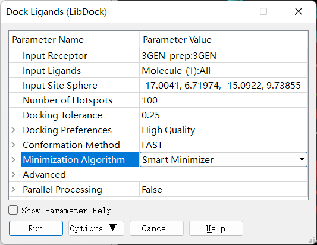
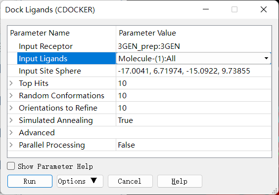
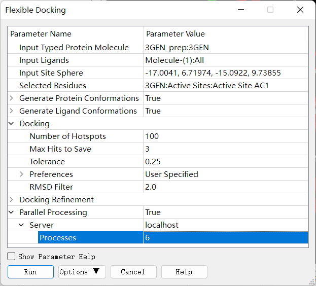
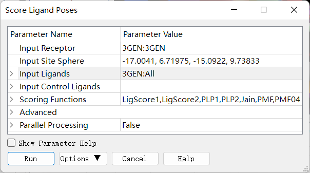
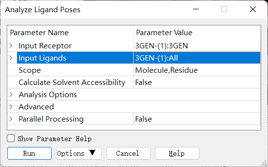

基于结构的药物设计 (Structure‐based drug design) (SBDD)
========================================================

介绍
---------

早期药物发现的途径

1803年德国药师萨顿从阿片中分离到黄色结晶(吗啡)

1971年提取、分离、鉴定紫杉醇 “卵巢癌和转移性乳腺癌治愈率达33%，总有效率达75%以上”

一直到20世纪70年代，随机筛选/偶然发现仍然是最主要的先导化合物发现方式，至今仍不可替代

计算机辅助药物设计方法：

.. image:: /images/78.png

基于结构的药物设计的基本概念
:::::::::::::::::::::::::::::

基于结构的药物设计（Structure‐based drug design, SBDD），广义上讲是基于配体结构和受体蛋白结构的药物设计的统称；狭义上讲就是基于受体结构的药物设计，即依据与药物作用的靶点（广义上的受体，如酶、受体、离子通道、抗原、核酸、多糖等）的三维结构，运用分子识别原理（互补性），设计对受体进行调控的先导物，或根据已有药物作用力大小和构效关系判断来推测新化合物的药效，达到发现活性分子的目的。

基于配体的药物设计也称为间接药物设计；基于受体结构的药物设计也称为直接药物设计。

蛋白质的结构与预测
------------------

蛋白质的三维结构
:::::::::::::::::

蛋白质是生物体中含量最丰富的生物大分子，参与了细胞中大部分的生命过程，是细胞最重要的组成物质。

当一个或多个蛋白的结构、功能或其参与相互作用的信号通路发生异常，将引起人类疾病的发生。经过严格的靶标验证实验，那么它就可能成为药物设计的靶标蛋白，通过设计药物分子与靶蛋白的结合便可达到治疗疾病的目的。

对靶蛋白三维结构的获取及分析则是SBDD的先决条件。

蛋白质的基本结构单元：氨基酸

组成蛋白质的种类繁多，结构各异，但元素组成基本相似，主要有碳（C）、氢（H）、氧（O）、氮（N）和硫（S）。除此以外，有些蛋白质发挥功能还需要少量金属离子的参与，如铁（Fe2+）、镁（Mg2+）、钙（Ca2+）和锌（Zn2+）等。

氨基酸的分类

疏水性氨基酸：

.. image:: /images/79.png

这些疏水侧链参与了范德华（van der Waals, vdW）相互作用，它在维持蛋白质构象中起着主要的作用，是蛋白质折叠的主要驱动力。

苯丙氨酸Phe的苯基侧链有时能参与较弱的极性相互作用。

Pro比其它任何氨基酸残基都具有更强的立体化学效应，它的侧链是和主链氮共价相连的，封闭的环常常形成一个转角，改变了主链的方向。

带电氨基酸:

.. image:: /images/80.png

带电荷的氨基酸都属于亲水性氨基酸，包括酸性氨基酸，如天冬氨酸和谷氨酸和碱性氨基酸，如精氨酸、赖氨酸和组氨酸。这些氨基酸主要参与了氢键相互作用和正负电荷的吸引作用（即盐桥）。

.. image:: /images/81.png

组氨酸在电中性状态下，其氮原子上的氢可在两个氮原子上互变（τ互变和π互变），pKa均在6左右，具体以哪个异构体为主取决于其周围的环境；当两个氮均被质子化时，氨基酸整体带正电荷。

在pdb中，组氨酸的残基名都用“HIS”表示，而在Amber力场中，τ互变、π互变及带正电的His则分别表示为“HIE、HID和HIP”。

极性中性氨基酸：

.. image:: /images/82.png

Ser、Thr、Asn和Gln主要参与氢键相互作用，属于亲水性氨基酸。

芳香环类侧链如Tyr和Trp虽然是疏水的，但它们都能形成氢键，可以位于蛋白质的内部或外部。

具有完全疏水性侧链的Phe是蛋白质内部疏水核心的主要成分。

成对的Cys残基能形成二硫键，从而增强蛋白质结构的稳定

Cys也与His一样，常见于酶活性位点

当侧链的巯基去质子化时具有较强的亲核性，常作为共价药物设计的靶向残基。

蛋白中辅因子的作用：辅助蛋白质折叠，物质运输，辅助酶催化

氨基酸通过肽键组成多肽

* 一个氨基酸的氨基与另一个氨基酸的羧基通过脱水形成的酰胺键称为肽键。
* 由两个氨基酸形成的肽为二肽，以此类推。不超过10个氨基酸形成的肽也被统称为寡肽，超过10个氨基酸的肽也称为多肽。

氨基酸通过肽键组成多肽

* 位于肽键平面外的另外两个单键（N-Cα和Cα-C）在没有侧链位阻的情况下是可以自由旋转的。
* 绕肽键一边的N-C_α键旋转的角称为phi（φ），绕着同一C_α原子的C_α-C键旋转的角被称为psi（ψ）。
* 其主链具有可旋转键和刚性平面相互交替的特征，自由度仅与两个构象角密切相关。

拉氏图（Ramachandran图）

.. image:: /images/83.png

* 将蛋白或多肽主链的φ和ψ值可视化作成的图形称为拉氏图，由 G. N. Ramachandran 等人提出的，以φ和ψ的角度为横纵坐标，规定φ和ψ角允许的构象区域的一个图形
* 主要的应用包括了辅助结构生物学中蛋白晶体结构的解析以及对同源建模后模型质量的检测。

在线服务：PROCHECK（https://www.ebi.ac.uk/thornton-srv/software/PROCHECK/）

蛋白质的高级结构

在生理温度下，水溶液中蛋白质的多肽链在大多数情况下折叠成呈球状。蛋白质中不同氨基酸的序列是它的一级结构（primary structure），直接由编码它的基因序列决定，序列又决定了蛋白折叠成更高级别结构的方式，包括二级结构、三级结构和四级结构。

蛋白质的高级结构：二级结构

α螺旋（α-helix） 

上：β转角（β-turn）

下：β折叠（β-sheet）

卷曲或环形区域（coil or loop）

蛋白质结构的获取方法

* X‐射线晶体学（X‐ray crystallography）:通过对衍射的位置、强度计算，读出原子坐标值（电子密度），解析结构得到晶体空间结构。在SBDD中，同一靶点的晶体结构要尽可能选择分辨率（Resolution）高（数值低）的结构作为靶标结构进行后续设计。
* 冷冻电镜技术（Cryo‐EM）：冷冻电镜，是用于扫描电镜的超低温冷冻制样及传输技术(Cryo‐SEM)，可实现直接观察液体、半液体及对电子束敏感的样品，如生物、高分子材料等。
* 核磁共振技术（NMR）：核磁共振能够给出单个功能基团的信息,如离子化状态、pKa和氢键；提供溶液中主链和侧链的动态运动的位点特异信息。NMR的优势在于能在接近自然生理环境的条件下对生物分子进行研究。
* 蛋白质三维结构预测：

.. image:: /images/84.png

基于理论的预测方法：从头预测法（ab initio prediction）

* 原理：采用理论计算（分子力学、分子动力学、量子化学）方法，直接从分子和原子参数模拟肽段在三维空间中所有可能的姿态，并计算出自由能最低的一个。
* 特点：计算量极大，不常用。
* 代表工具：QUARK https://zhanglab.ccmb.med.umich.edu/QUARK/

基于知识的预测方法：穿针引线法，折叠识别（threading, fold recognition）

* 原理：通过比较目标序列与已知的折叠库，找到目标序列的折叠模式，并使用相关的方法将各个部分的折叠连接起来。
* 特点：折叠法是近年来发展起来的一种比较新的方法。它可以应用到没有同源结构的情况中，且不需要预测二级结构，即直接预测三级结构，从而可以绕过现阶段二级结构预测准确性不超过 65% 的限度，是一种有潜力的预测方法。
* 代表工具：I-TASSER (Iterative Threading ASSEmbly Refinement)https://zhanglab.ccmb.med.umich.edu/I-TASSER/

基于知识的预测方法：同源模建法（homology modeling）

* 原理：根据待建模序列（目标）与一个或多个已知蛋白结构的序列（模板）间的同源性（序列一致性），直接由目标序列的一级结构预测其三级结构
* 理论基础：蛋白质三级结构的保守性远超过一级序列的保守性
* 特点：模板蛋白和目标蛋白的序列一致性需要大于30%，越大建模准确性越有保障。
* 代表工具：(1) MODELLER (https://salilab.org/modeller/) (2) SWISS-MODEL (https://swissmodel.expasy.org/)

同源模建的步骤（以DS MODELER为例）

1. 搜索并识别模板：

   * 查找目标蛋白序列（https://www.uniprot.org/）
   * 搜索并识别模板
  
      * 载入序列
      * 使用BLAST搜寻模板：每行表示一条命中的氨基酸序列。命中的序列按照E值（序列无缝比对存在偶然性的可能性大小，表征了序列比对的可行度）进行排序。E值最低的序列，结果最可靠，排在第一行。
      * 挑选一个或多个合适的同源模板（templates）。一个理想的template 需要涵盖整个target 的长度，具有较高的序列一致性（Sequence identity），并且E 值要够小（小于 1×10^-5）。一般而言，若有多条模板与target 都具有相似的同源性，但模板之间相似性并不非常高，那么通常使用多模板来构建同源模型，使建模过程中模型的每个部分都采用最合适的模板。 
  
2. 序列比对：通过多序列比对将目标序列直接比对至模板序列
3. 产生全原子模型（自动产生）
   
   * 模型的PDF Total Energy越低，表明该模型在同源约束条件下优化的越好；模型同限定的同源约束条件偏差越小，该模型的可信度越大
   * DOPE是一个基于原子统计势能的程序，主要用于模型评估。它的分数可以认为是衡量同一分子不同构象可信度的标准，能够帮助选择预测结构的最优模型。分数越低，模型质量越可靠。一般可以粗略地选取PDF Total Energy最低的模型作为最合理的初始模型；若其值相似，则可以利用DOPE score作为衡量模型质量的依据。
   * loop区建模：主要是目标蛋白和模板蛋白的比对结果中存在缺口的部分如何处理的问题。第一种解决的方式是略去模板蛋白存在的残基，留下一个必须补上的缺口。另一种情况是将主链截断，插入缺少的残基。
   * 侧链建模：构造各种可能的构象体，并利用基于能量的函数打分来实现侧链构象的选择的
  
4. 模型优化：模型产生初始坐标后，还要对分子结构进行进一步的优化，以此消除/缓解原子间的重叠或某些不合理构象（尤其是非保守区的构象）。优化一般采用分子力学或分子动力学。
   
   注意事项：

    * 对柔性区域的构象进行构象分析可以采用分子动力学方法
    * 在进行分子力学优化时，应尽量避免破坏模型的主链结构，一般要采取限制性优化方法
    * 在修正过程中，应考虑溶剂效应的影响
  
5. 模型评估：
   * 拉氏图：蛋白主链二面角的拉氏图（当落于核心区+允许区的氨基酸残基百分比>95%时，表明模型质量较高）
   * Profile-3D：Profile-3D 是UCLA 的David Eisenberg 教授开发的一种基于“穿线”（threading）法的模型评估程序。该方法采用3D-1D 的打分函数来检测所构建模型与自身氨基酸序列的匹配度关系。分数越高，说明同源模型的可信度越大。Verify Score 越接近或高于Verify Expected High Score，模型的质量越好。

实验：同源模建法构建蛋白质的三维结构
--------------------------------------

实验目的：
::::::::::::
1. 掌握通过同源模建法进行未知跨膜蛋白 P2RY6 的三维结构的构建。

实验原理：
::::::::::::

认为蛋白质三级结构的保守性远超过一级序列的保守性。所以根据待建模序列（目标）与一个或多个已知蛋白结构的序列（模板）间的同源性（序列一致性），直接由目标序列的一级结构预测其三级结构。模板蛋白和目标蛋白的序列一致性需要大于 30%，越大建模准确性越有保障。本实验使用 Discovery Studio 软件通过同源模建法进行未知跨膜蛋白P2RY6 的三维结构的构建。

本实验所用的软件环境：

* DS Version：19.1.0.18287
* PP Version：19.1.0.1963
* DS Client Version：19.1.0.18287
* OS Distribution：Windows
* OS Version：10.0.19044

实验步骤：
::::::::::

1. 查找目标蛋白序列：进入 Uniprot 网站（https://www.uniprot.org），搜索目标蛋白，本实验中搜索 P2RY6。点击 Q15077，点击 Download，再点击 FASTA(canonical)，`下载`_ 目标蛋白序列。

.. _`下载`: https://rest.uniprot.org/uniprotkb/Q15077.fasta

.. image:: /images/85.png

2. Blast 蛋白序列比对：

目标蛋白序列的填入：使用 Discovery Studio 软打开刚下载的名为Q15077.fasta的文件。结果如下图：

.. image:: /images/86.png

Blast 蛋白序列比对：点击 Discovery Studio 软件上的 Macromolecules ——> Create Homology Models ——> BLAST Search (NCBI Server)来进行蛋白晶体数据库中相似蛋白的查找。

.. image:: /images/90.png
.. image:: /images/87.png

3. 选择合适蛋白模板：本实验选择了 4XNV_A（E-value 最小，E-value（E值）小于 1×10^-5，模板蛋白和目标蛋白的序列一致性大于30%），右键此选项，点击Load Selected Structures 进行蛋白模板的载入。

4. 创建序列-结构对齐矩阵：点击 Discovery Studio 软件上的 Macromolecules ——> Create Homology Models ——> Align Sequence to Templates 生成模板蛋白与目标蛋白的结构对齐矩阵。设置参数如下：

.. image:: /images/88.png

5. 蛋白建模：点击 Discovery Studio 软件上的 Macromolecules ——> Create HomologyModels ——> Build Homology Models 进行同源模型的建立。设置参数如下：

.. image:: /images/89.png

6. 模型评估：

拉氏图的绘制：点击 Discovery Studio 软件菜单栏上的 Chart ——> Ramachandran Plot 分别对每个同源模型进行拉氏图的绘制。

Profiles-3D：点击 Discovery Studio 软件上的 Macromolecules ——> CreateHomology Models ——> Verify Protein (Profiles-3D) 分别对每个同源模型进行 Profiles-3D 的绘制。设置参数如下：

.. image:: /images/92.png

以残基打分作图：选上全部新生成的模型，选择 AminoAcid 选项卡，点击 Discovery Studio 软件菜单栏上的 Chart ——> Line Plot，X 轴设为 name，Y 轴设为 verify score，Color by Data Series 设为Molecule 同时给每个同源模型进行残基打分作图，如下图所示。

.. image:: /images/93.png

实验结果：
:::::::::::

`Blast 蛋白序列比对的结果`_ , `创建序列-结构对齐矩阵的结果`_ , `蛋白建模的结果`_, 

.. _`Blast 蛋白序列比对的结果`: https://computer-aided-drug-design.github.io/CADD-Tutorial-Experiments-Result/experiment_results/BLASTSearchNCBIServer_2022_09_21_214334_399/Output/Report.htm
.. _`创建序列-结构对齐矩阵的结果`: https://computer-aided-drug-design.github.io/CADD-Tutorial-Experiments-Result/experiment_results/AlignSequencetoTemplates_2022_09_21_214915_437/Output/Report.htm
.. _`蛋白建模的结果`: https://computer-aided-drug-design.github.io/CADD-Tutorial-Experiments-Result/experiment_results/BuildHomologyModels_2022_09_21_215451_145/Output/Report.htm

拉氏图的绘制的结果：

.. image:: /images/91.png

`Profiles-3D的结果`_

.. _`Profiles-3D的结果`: https://computer-aided-drug-design.github.io/CADD-Tutorial-Experiments-Result/experiment_results/VerifyProteinProfiles-3D_2022_09_21_220456_652/Output/Report.htm

以残基打分作图的结果：

.. image:: /images/94.png

基于人工智能的预测方法：Alphafold

2020年12月1日，国际蛋白质结构预测竞赛CASP公布的数据显示，谷歌旗下人工智能技术公司DeepMind开发的深度学习算法Alphafold的表现超过了大约100个其他团队，准确性达到了与实验室方法不分伯仲的水平，一举解决了困扰学界长达五十年之久的蛋白质折叠问题。

2021年7月，DeepMind发布了最新版本AlphaFold2的源代码，以及详细描述了它是如何开发的。https://alphafold.ebi.ac.uk/

基于结构的药物设计（SBDD）
--------------------------

基本概念与理论
::::::::::::::

靶点（受体）：能识别和结合生物活性物质（配体），并产生生物效应的结构。

生物活性物质（配体）：

* 内源性活性调解物：维持机体机能的基本生理机制，如多巴胺、激素等。
* 外源性药物：干预机体生理生化作用。

靶点学说（受体理论）

一种有效的药物必须符合以下三个要求：
* 作用于靶点（与机体内的某一种或多种靶点发生相互作用）（药效学要求）
* 暴露于靶点（药物到达靶点、达到适宜的浓度 C_max 并维持足够的时间 AUC ）（药代动力学要求）
* 不与其他无关靶点作用（ 无 off target 效应） （安全性要求）

配体‐受体相互作用方式

“锁‐钥”原理 

.. image:: /images/95.png

空间形状契合、相互作用力契合

诱导契合原理（“手‐手套” 原理）

.. image:: /images/96.png

配体构象变化、受体构象变化

分子识别：药物分子与靶蛋白发生相互作用的驱动力是分子识别。

定义： 药物在特定条件下通过分子间作用力（可逆 ）与靶点相结合的过程。其中，某些药物也可形成共价键 （不可逆 ）。

分子识别的两个决定性作用：互补性(形状和电性互补)和预组织作用（去溶剂化和构象扰动）。

.. image:: /images/97.png

范德华力（van der Waals Force, VDW）

.. image:: /images/98.png

* 相邻的电中性原子互相靠近，会有短暂的微弱吸引力，即范德华力
* 主要的分子间作用力
* 原子间距离为0.3～0.5 nm，范德华力的能量为1.9 kJ/mol
* 主要分为：色散力、诱导力、取向力
  
   色散力（Dispersion force）：所有分子或原子之间都存在，由于电子的运动产生的瞬时偶极键的作用力。

   * 分子的变形性越大（一般分子量越大，变形性越大），色散力越大
   * 分子的电离势越低（分子内所含的电子数越多），色散力越大。

   诱导力（Induction force）：在极性分子‐非极性分子之间，极性分子‐极性分子之间，都存在诱导力。

   * 极性分子与非极性分子接近时，极性分子的永久偶极产生的电场使非极性分子极化产生诱导偶极。永久偶极与诱导偶极间的吸引力称为诱导力。
   * 诱导力同样存在于极性分子之间，对极性分子而言，诱导力是附加的取向力。

   取向力（Orientation force）：取向力发生在极性分子‐极性分子之间。

   * 当极性分子互相接近时，分子的永久偶极之间同极相斥、异极相吸，使分子在空间按一定取向排列吸引，而处于较稳定的状态。这种永久偶极间的吸引力称为取向力。
   * 取向力与分子的偶极矩平方成正比，即分子的极性越大，取向力越大。

疏水键（Hydrophobic bond）

疏水键是两个不溶于水的分子间的相互作用。这种因能量效应和熵效应等热力学作用使疏水基团在水中的相互结合作用称为疏水键。

* 疏水作用与分子中疏水基团和片段的数目成正比，烷基越多，疏水性越强。

疏水键的本质

.. image:: /images/99.png

氢键 (Hydrogen bond)

氢键：氢原子与电负性大的杂原子共价结合，与另一具有未共用电子对的杂原子以氢为媒介，形成以X‐H…Y形式的一种弱的静电引力。

* 氢键具有饱和性和方向性，在药物和受体形成氢键时，双方的原子和基团在空间的取向和距离决定了结合强度
* 氢键在化学和生物学的多个领域中扮演着重要的角色，是驱动生物分子间可逆相互作用的主要力量

氢键的方向性

.. image:: /images/100.png

氢键供体能量强度

使用HCN作为受体探针计算34个氢键供体形成氢键的能量大小，排序结果如下：

.. image:: /images/101.png

Ref: J. Chem. Theory Comput. 2020, 16, 2846−2856

氢键受体能量强度

使用HCN作为受体探针计算67个氢键供体形成氢键的能量大小，排序结果如下：

.. image:: /images/102.png

静电作用 (Electrostatic interaction)

离子键（Ionic bond）

离子键：两个具有相反电荷的离子间的静电引力，也叫离子离子相互作用。

* 离子键无方向性，是随机转运的药物与受体的初始感受，对于两者间的趋近与识别有重要作用。
* 作用能较强，但在水中，去水合作用与静电引力对复合物形成的能量贡献相反，因而形成抵消效果。

离子‐偶极作用（Ion‐dipole interaction）：带电荷的原子或基团与含有偶极的基团之间的静电引力。对稳定药物受体复合物起到重要作用，但弱于离子键。

偶极‐偶极作用（Dipole‐dipole interaction）：两个偶极分子或偶极键之间的静电引力，弱于离子‐偶极作用。

π‐π相互作用（π‐π interaction）

π‐π相互作用：芳环含有环形π键，芳环之间的π键可发生π‐π相互作用，又称为π‐π堆积作用（π‐π stacking）。

* 作用力较弱，但在生物体内普遍存在，作用能量大约8~12 kJ/mol。
* 芳环堆积的三种类型
  
.. image:: /images/103.png

从静电吸引角度分析π体系的各种相互作用

.. image:: /images/104.png

阳离子‐π相互作用（Cation‐π interaction）

阳离子‐π相互作用：由有机或无机阳离子与π电子体系的负电势之间的静电引力，能力强度与氢键相近。

* 在水介质中，阳离子‐π相互作用强于离子键。

共价键（Covalent bond）：键能高，约140～800 KJ/mol，结合牢，驻留时间较长，治疗指数高。除了被特异性酶酶解而发生共价键断裂外，不易被破坏。因此产生的药物作用持久，为不可逆过程。

共价药物：共价键键合类型常见于作用于病原体或肿瘤细胞的靶点。药物的共价基团往往具有较高的化学活性而缺乏特异选择性。

配位键（Coordinate bond）

配位键：又称配位共价键，一种特殊的共价键，其共用的电子对是由其中一原子独自供应，另一原子提供空轨道。

* 过渡金属的核电荷高，半径小，有空的d轨道和自由的d电子，它们容易接受配位体的电子对，又容易将d电子反馈给配位体。因此，它们都能形成稳定的配合物。

水分子在药物设计中的作用
:::::::::::::::::::::::::::::::

药物设计时需要考虑的溶剂化效应

* 药物和受体在结合前都处于水的溶剂化状态，为了双方的结合需去溶剂化，这是耗能过程，能量由结合能得到补偿。
* 如果去溶剂化能大于结合能，药物难以与受体稳定结合，所以分子设计时要确定形成氢键的因素是否是多余。

.. image:: /images/105.png

水分子既是氢键给体也是氢键受体，可参与药物与受体的结合

基于计算：WaterMap

* 由Schrödinger公司开发的一种较为流行的基于分子动力学模拟（MD）的水分子位点预测工具，可预测蛋白质结合位点中水分子的位置和能量。
* WaterMap算法步骤：1、进行约2ns的约束性MD模拟（溶质约束），根据密度分布对水分子位置和方向进行聚类；2、使用非均相溶剂理论计算每个水合位点的热力学性质（相互作用能、熵增和自由能），以此来决定靶向哪个特定的水分子。

基于计算：SZMAP (solvent‐zap‐map)

* SZMAP是OpenEye应用软件包中的一个模块，是一款水分子位置与稳定性预测软件。无需分子动力学模拟采样。
* SZMAP采用显式水分子探针在高介电连续溶剂(high‐dielectric continuumsolvent)中快速计算分子表面附近溶剂化自由能的大小与分布。
* 它可以预测特定水分子对配体结合的稳定化或不稳定化效应，还可以识别结合水的位置和哪些位置的水是无序的。在结合位点，更好地理解这些效应有助于先导化合物的优化和药物设计其他方面问题的研究。

基于计算：3D‐RISM (three‐dimensional reference interaction site model)

* 该程序集成在MOE、Flare和Amber中。
* 计算水H和O密度的时间平均分布，以及用于分析溶剂稳定性和溶剂化对结合自由能的贡献的自由能图。 3D‐RISM的独特之处在于它能够包含各种浓度的盐或疏水分子作为溶剂的一部分，从而生成离子，疏水基团以及水的密度图。
* 基于力场，无需分子动力学模拟采样。

热力学理论在药物设计中的应用

多数药物与受体作用是以非共价键形式结合，形成的复合物与游离的配体和受体之间呈动态平衡。这种结合作用是由热力学自由能(ΔG)变化所驱动，结合越强，配体‐蛋白复合物的离解常数(K_d越小，ΔG负值越大。ΔG与K_d的关系由吉布斯‐范特霍夫（Gibbs‐Van’t Hoff）方程表征:

ΔG = RTlnK_d  R = 8.13 J∙mol^‐1∙K^‐1，T为绝对温度。当T = 300 K时，ΔG = 5.7logK_d (kJ/mol)

根据吉布斯‐亥姆霍兹（Gibbs‐Helmholtz）方程，ΔG是由焓（ΔH）和熵（‐TΔS ）构成，即：

ΔG = ΔH – TΔS

配体与受体结合产生自发过程的为负值，所以从上式看，ΔH为负值和‐TΔS为负值，有利于结合过程。ΔG中ΔH和TΔS有各自的贡献，参与并维持着游离的配体和受体与复合物之间的平衡作用。

配体与受体结合的焓‐熵变化，常常是有利的 ΔH 被不利的 ‐TΔS 所抵消，或者有利的 ‐TΔS 以不利的 ΔH 作负性补偿，这就是配体‐受体结合作用的焓‐熵补偿(enthalpy‐entropy compensation)。

.. image:: /images/106.png

如果│ΔH│＞ │TΔS│，则该结合为焓驱动结合，反之，则为熵驱动。

热力学量的实验测定——等温滴定量热法(isothermal titration calorimetry，ITC)

.. image:: /images/107.png

* 可直接测量生物分子结合过程中释放或吸收的热量。
* 准确地确定结合常数 (K_D)、反应化学量 (n)、焓 (∆H) 和熵 (‐TΔS)。

热力学量的计算方法——结合自由能(binding free energy)的计算

在分子模拟领域，准确计算结合自由能仍然是一个挑战。为此，人们发展了许多方法。如：

* 自由能微扰(FEP)与热力学积分(TI)：计算量很大, 不适用于生物大分子体系
* MM‐PBSA (Molecular Mechanics‐Poisson Bolzmann Surface Area, 分子力学泊松玻尔兹曼表面积)：准确度不如FEP，但计算量小, 在分子识别, 区分结合的强弱方面是一种有效的方法，可得到ΔG、ΔH 和‐TΔS的具体值。

分子对接技术 (Molecular docking)
----------------------------------------

分子对接的原理
::::::::::::::::::::

定义：利用算法将配体小分子（如药物）放置到受体大分子（如靶标蛋白）的结合位点（Binding site），预测小分子与受体结合构象（Pose）及作用能的过程。

* 分子对接是一种广泛应用的研究分子间相互作用的分子模拟方法，其过程涉及小分子与受体之间的空间匹配和能量（性质，电性等）匹配。
* 利用分子对接方法研究蛋白‐配体作用模式在SBDD中的应用非常广泛。

分子对接的最初思想起源于1894年Fisher提出的受体学说。Fisher认为，药物与体内的蛋白质大分子即受体会发生类似药物与锁的识别关系，称为“锁钥模型”，这种识别关系主要依赖两者的空间匹配。

真正算法上的实现是在1982年，美国加州大学旧金山校区（UCSF）的Irwin Kuntz教授率先提出了“分子对接”的概念，并发表了第一个分子对接软件“DOCK”，至今仍被广泛应用。

分子对接中的两大关键问题：空间匹配和能量匹配

* 空间匹配是分子间发生相互作用的前提。
* 能量匹配是分子间保持稳定结合的基础。配体分子进入结合位点时，通过一定的程序计算它们之间的结合模式和结合能，并对结果进行评价，通过打分函数评判配体-受体的结合程度

分子对接的分类
::::::::::::::

根据对接过程中是否考虑研究体系的构象变化，将其分为

* 刚性对接：将配体和受体构象都当做刚性处理，以降低计算量
* 半柔性对接：受体保持刚性，配体则完全当做柔性分子进行处理，当前的大多数分子对接软件都采取这种模式
* 柔性对接：对接过程既考虑小分子柔性，又可考虑受体部分区域（如结合口袋中的残基）的柔性

.. image:: /images/108.png

常用的分子对接算法
::::::::::::::::::::::::

刚性对接、半柔性对接：LibDock、CDOCKER、Glide、GOLD、AutoDock、DOCK、MOE_dock、FlexX、Surflex‐dock
柔性对接：Flexible docking、Induced fit docking（IFD）
片段对接：MCSS
共价对接：Covdock、GOLD、MOE
蛋白‐蛋白对接：ZDOCK、ICM‐Docking

分子对接的核心步骤
:::::::::::::::::::::::::

搜索算法：搜索配体与受体的可能结合模式。在分子对接中，配体小分子在受体结合口袋中会有不同的取向和构象，其中配体构象搜索方法起重要作用。对接问题的核心，就是在指定的构象空间内，采取合适的算法搜索合适的配体构象的过程。

* 系统性搜索（Systematic search）：系统搜索，就是在构象搜索时尽可能的去系统地遍历配体全部的自由度或结构参数的组合。但是，随着分子可旋转键数目的增多，配体构象空间会急剧膨胀，要做到完整采样并不现实。分子对接中常用的系统搜索算法有穷举搜索（Exhaustive Search）、基于片段的搜索（Fragment‐based Search）和构象系综搜索（Conformational Ensemble Search）等。
* 启发式搜索（Heuristic search）：启发式搜索（随机搜寻法），需对配体三维坐标进行随机改变产生新的构象，然后根据预先定义的评价函数对新构象进行取舍，通过不断迭代收敛于全局最优或近似最优构象。常用的启发式搜索算法包括蒙特卡洛（Monte Carlo, MC）算法、遗传算法（Genetic Algorithm, GA）、模拟退火（Simulated Annealing, SA）算法和群智能（Swarm intelligence, SI）算法等。
* 确定性搜索（Deterministic search）：确定性搜索，初始状态可以确定下一状态的改变趋势，即向能量减小的方向进行。如果体系初始状态完全相同，当使用相同的参数进行构象搜索，就会到达相同的终态。这种方法在进行构象搜索时一般很难越过势垒，因此容易陷入局部最小值。分子对接中常用的确定性搜索算法主要是分子动力学模拟，代表性程序为基于CHARMm力场的CDOCKER。

打分函数：打分函数是影响分子对接精度的另一个重要因素，其主要作用是评估配体和受体分子间的亲和力。用于评价同一分子的各种构象以及不同分子的最佳构象。

* 基于力场的打分函数（Forcefield）：基于力场的打分函数一般采用分子力场的非键作用能项来计算受体和配体之间的相互作用能。只考虑热焓对能量的贡献，不考虑熵的影响，一般情况下，采用标准力场的真空静电和范德华作用两项的加和来计算，有些打分函数还会考虑氢键项的贡献。
  
   * 基于力场的打分函数通式：:math:`ΔG_{binding}=ΔE_{vdw} + ΔE_{ele} + [ΔE_{Hbond}]`
   * DOCK程序中采用AMBER的能量函数: :math:`E = \sum_{i=1}^{lig} \sum_{j=1}^{rec}(\frac{A_{ij}}{r_{ij}^{12}}-\frac{B_{ij}}{r^6_{ij}}+\frac{q_iq_j}{\epsilon(r_{ij})r_{ij}})` 
   * 其它常用的基于力场的打分函数：AutoDock的打分函数、Goldscore等
  
* 经验打分函数是受体和配体结合的自由能可以近似为不相关的不同能量项的贡献。通过计算并加和各个分能量项求得总的结合自由能。
   * 这些分能量项包括：氢键作用能、疏水作用能、离子化、熵的贡献、金属离子作用等
   * 常用的经验打分函数如PLP、ChemScore、GlideScore、LUDI等
   * ChemScore采用如下函数形式：:math:`ChemScore = S_{Hbond} + S_{metal}+ S_{lipophilic} + P_{rotor} + P_{strain} + P_{clash} + [P_{covalent} + P_{constraint}]`

* 基于知识的打分函数，通过加和受体和配体之间的原子对统计势（Pairwise Statistical Potential）来计算配体和受体之间的结合能力。

   .. math:: A = \sum_i^{lig}\sum_j^{pro}\omega_{ij}(r)

   * 距离依赖的原子对之间的作用势 :math:`ω_{ij}(r)` 由下式计算得到：:math:`ω_{ij}(r) = -k_BTln[g_{ij}(r)] = -k_BTln[\frac{𝜌_{ij}(r)}{𝜌^∗_{ij}}]`; :math:`𝜌_{ij}(r)` 是原子对i‐j在距离r时的密度；:math:`ρ^*_{ij}` 是原子对在参考态时的密度
   * 常用的基于知识的打分函数：PMF、IT‐Score、DrugScore等

* 一致性打分（Consensus Score）：将几个不同打分函数的结果相结合，这种方法通常被称为“一致性评分”。 根据这种方法，使用多个打分函数来评分结合构象，相当于对对接结果进行二次打分（一致性打分）是非常有效的消除假阳性方法。

.. image:: /images/109.png

分子对接的一般流程
:::::::::::::::::::::

1. 受体结构的准备

* 靶点检验：X‐ray晶体结构要检查分辨率（分辨率越高越好）、种属、突变情况、结构的完整性等
* 受体结构处理（以晶体结构为例）：加氢、加电荷、带电残基的质子化状态、水分子的处理、助溶剂分子的删除、补充缺失的残基

2. 结合位点确定

* 复合物中的配体去除（最简单）
* 同源蛋白模型的结合位点信息
* 定点突变实验
* 程序算法：Cavity（DS）、SiteMap（Schrӧdinger）、SiteFinder（MOE）
  
3. 配体（小分子）结构准备
   
* 3D结构转化
* 加氢、加电荷、质子化状态（pH: 7.4）、手性和互变状态确定
* 如果是小分子化合物库，还需进行类药性分析和假阳性子结构过滤
  
4. 对接过程（参数设置）

* 对接算法的选择：使用重对接（native docking），将复合物晶体结构中的小分子重新对接到该复合物中，比较对接构象与晶体构象的均方根偏差值（RMSD），该值越小（通常要小于2 Å）说明对接构象与晶体构象越接近，对接算法对小分子结合构象的重现性越好，对接算法越可靠。

.. image:: /images/110.png

参考：J Mol Graph Model 2015 Vol. 60 Pages 142‐154

* 打分函数的评价（同一个受体结构）：

   * 同一配体的不同结合模式（pose）：对于重对接而言，比较各pose的打分值与其RMSD值的相关性，相关性越高，则说明打分函数越能反映对接构象的准确性。
   * 不同活性的配体：比较各配体打分最高的结合构象的活性值与打分值的相关性，相关性越高，说明该打分函数能较为准确的反映配体的活性（注：选择不同的配体活性值之间要至少相差一个数量级）。

* 其它参数设置：可先使用软件预设值，然后再根据初步对接结果（如重对接结果）进行调整

5. 对接结果分析

* RMSD值计算（重对接）
* 配体‐受体非键相互作用分析
* 配体‐受体相互作用2D图
* 受体结合口袋表面
* 残基相互作用分析
* 多种打分函数分析
* 结合能分析带溶剂化模型

分子对接的应用
:::::::::::::::::::

确定配体和受体可能的结合构象，及其与靶标结合口袋内残基的相互作用细节，从而阐明活性化合物的作用机制，为分子的结构优化打下基础

对靶标进行基于结构的虚拟筛选，从而辅助发现对该靶标具有潜在活性的候选化合物

对同系列化合物进行分子对接，可以得到分子叠合构象，从而进行基于结构的3D‐QSAR研究

通过反向对接找到小分子可能作用的靶标

Discovery Studio中的分子对接算法简介
::::::::::::::::::::::::::::::::::::::

.. image:: /images/111.png

.. image:: /images/112.png

LibDock：LibDock根据小分子构象与受体相互作用的热区（Hotspot）匹配的原理将这些构象刚性对接到受体的结合口袋中，其最大的优势在于速度快，可以并行运算，适合于对大规模数据库进行快速精确的虚拟筛选

   极性格点：受体中能与配体分子中可以形成氢键的原子相匹配的部分

   非极性格点：受体中能与配体分子的非极性原子相匹配的部分

LibDock计算过程

.. image:: /images/113.png

CDOCKER：CDOCKER是基于CHARMm力场的半柔性对接程序，采用高温动力学来搜索配体分子的柔性构象空间，并采用模拟退火的方法将各个构象在受体活性位点进行优化，从而使对接结果更加精确。

CDOCKER计算过程

.. image:: /images/114.png

Flexible Docking：Flexible Docking可以实现受体‐配体的双柔性对接，模拟受体与配体的诱导契合效应，可以精细地研究受体‐配体相互作用信息，适用于作用机理的研究。

Flexible Docking计算过程

.. image:: /images/115.png

Discovery Studio中的非键相互作用分析
::::::::::::::::::::::::::::::::::::::::::::::

.. image:: /images/116.png

分子对接计算的注意点
::::::::::::::::::::::::::::

小分子问题

* 小分子的起始构象、电荷和质子化状态对对接结果有一定影响

蛋白受体问题

* 如何选择靶标晶体结构？
* 定义活性位点的位置和大小？
* 活性位点氨基酸残基的结构和质子化状态是否正确？

对接问题

* 根据研究目的和研究体系，选择合适的对接算法

分子对接尚未解决的问题

1. 溶剂化效应
2. 熵效应
3. 蛋白的柔性
4. 打分函数的准确性

分子重对接实验
---------------------

实验目的：
:::::::::::::::::::

1. 学会使用 Discover studio 进行半柔性和柔性重对接。
2. 学会使用 CDOCKER, LIBDOCK, Flexible Docking 程序重对接并比较。

实验原理：
:::::::::::::::::

本实验使用 Discovery Studio 软件通过 CDOCKER, LIBDOCK 和 Flexible Docking 程序进行 3GEN 蛋白与自带的配体的重对接。

半柔性对接：受体保持刚性，配体则完全当作柔性分子进行处理，当前的大多数分子对接软件都采取这种模式。

柔性对接：对接过程既考虑小分子柔性，又可考虑受体部分区域（如结合口袋中的残基）的柔性。

基于 CHARMm 力场的 CDOCKER 半柔性对接程序使用确定性搜索算法。确定性搜索是通过初始状态确定下一状态的改变趋势，即向能量减小的方向进行。如果体系初始状态完全相同，当使用相同的参数进行构象搜索，就会到达相同的终态。这种方法在进行构象搜索时一般很难越过势垒，因此容易陷入局部最小值。CDOCKER 模拟退火的方法将各个构象在受体活性位点进行优化，从而使对接结果更加精确。

CDOCKER计算过程

.. image:: /images/114.png

LIBDOCK 程序根据小分子构象与受体相互作用的热区（Hotspot）匹配的原理将这些构象刚性对接到受体的结合口袋中，其最大的优势在于速度快，可以并行运算，适合于对大规模数据库进行快速精确的虚拟筛选。

LibDock计算过程

.. image:: /images/113.png

Flexible Docking 可以实现受体‐配体的双柔性对接，模拟受体与配体的诱导契合效应，可以精细地研究受体‐配体相互作用信息，适用于作用机理的研究。

Flexible Docking 计算过程：

.. image:: /images/115.png

本实验所用软件环境：

* DS Version：19.1.0.18287
* PP Version：19.1.0.1963
* DS Client Version：19.1.0.18287
* OS Distribution：Windows
* OS Version：10.0.22000

一般流程：

.. image:: /images/117.png

大分子结构的准备：通过实验方法所测得的生物大分子三维结构或多或少存在一些缺陷，比如分辨率低导致模型质量不佳、晶体结构无 H 原子和电荷信息、在模型构建步骤中相对粗糙的力场带来的结构误差等，这就需要在做 SBDD 前对生物大分子（如蛋白）的三维结构进行准备和能量最小化。

实验步骤：
:::::::::::::

◆ 靶点结构的获取及准备

1. 查找靶点结构：本实验中搜索 3GEN 蛋白作为靶点。进入 PDB 网站(https://www.rcsb.org/），搜索靶蛋白。本实验中搜索 3GEN，选择 3GEN，点击 Download Files，再点击 PDB Format， `下载靶蛋白结构文件 <https://computer-aided-drug-design.github.io/CADD-Tutorial-Experiments-Result/experiment_results/PrepareProtein_2022_09_24_103147_557/Input/3GEN.dsv>`_ 。（如图所示）

.. image:: /images/118.png

2. 靶蛋白的准备：
		去除晶胞：点击Discovery Studio软件上菜单栏上的Structure --> Crystal Cell --> Remove Cell进行晶胞的去除。

		定义小分子配体：Discovery  Studio软件上，选上小分子配体，也就是单击Ligand Groups， 再点击Receptor-Ligand Interactions --> View Interactions --> Define Ligand: <undefined>来进行小分子配体的定义。

		蛋白结构准备：Discovery  Studio 软件上，点击 Macromolecules --> Prepare Protein，设置参数如下，来进行蛋白结构的准备得到新窗口3GEN_prep。接下来的操作都是在新的窗口当中进行。

      .. image:: images/119.png

      定义结合位点：Discovery  Studio软件上，选上小分子配体，也就是单击Ligand Groups， 再点击Receptor-Ligand Interactions --> Define and Edit Binding Site --> From Current Selection来进行结合位点的定义。

◆ 小分子配体的获取及准备

1. 配体小分子的获取：本实验中使用 3GEN 自带的配体。Discovery Studio 软件上，点击菜单栏上的 File → New → Molecule Window 创建新窗口，剪切 3GEN 自带的配体粘贴。
2. 小分子的准备和能量优化：
		点击 Discovery Studio 软件上的 Small Molecules → Prepare or Filter Ligands → Prepare Ligands 进行小分子的准备，设置参数如下。

		.. image:: images/120.png

		点击 Discovery Studio 软件上的 Simulation → Change Forcefield → Apply Forcefield；
      
      .. image:: images/121.png

      再点击 Discovery Studio 软件上的 Simulation → Run Simulations → Minimization 进行能量优化。设置参数如下：

      .. image:: images/122.png

◆ 半柔性分子对接

1. LIBDOCK 分子对接：确保当前窗口为准备好的大分子，即 3GEN_prep，删除配体，点击 Discovery Studio 软件上的 Receptor-Ligand Interactions → Dock Ligands → DockLigands (LIBDOCK) 进行 LIBDOCK 半柔性分子对接。设置参数如下：

2. CDOCKER 分子对接：确保当前窗口为准备好的大分子，即 3GEN_prep，删除配体，点击 Discovery Studio 软件上的 Receptor-Ligand Interactions → Dock Ligands → Dock Ligands (CDOCKER) 进行 CDOCKER 半柔性分子对接。设置参数如下：

◆ 柔性分子对接

确保当前窗口为准备好的大分子，即 3GEN_prep，删除配体，双击 Discovery Studio软件上的 Protocols → Discovery Studio → Receptor-Ligand Interactions → Docking → FlexibleDocking 进行 Flexible Docking 柔性分子对接。设置参数如下：

◆ 结果分析

1. RMSD 值计算：新建窗口，即点击 File→New→Molecule Window，将对接结果中的对接 pose 和原晶体结构中的小分子配体复制粘贴到新窗口中，把原晶体结构中的小分子配体设为参考分子。选中参考分子，依次选择菜单栏上的 Structure → RMSD → SetReference 来设定参考分子。在需要计算的 pose 边上打勾（这里假设计算全部），并确保呈选中状态，依次选择菜单栏上的 Structure → RMSD → Heavy Atoms 进行 RMSD 值计算。

2. 对对接结果进行重打分：在 Discovery Studio 中打开对接结果窗口（应该是 3GEN窗口），点击 Receptor-Ligand Interactions → Dock Ligands → Score Ligand Poses 进行对配体poses 打分，设置如下图，会生成新窗口。
   

3. 在新窗口中，点击选上 Discovery Studio 软件菜单栏上的 View → Explorers → Protocols。再然后从 Protocols 窗口中双击 Discovery Studio→ Receptor-Ligand Interactions → Scoring and Analysis → Analyze Ligand Poses 进行配体poses 分析，设置参数如下图。

实验结果：
:::::::::::::

1. `靶蛋白的准备 <https://computer-aided-drug-design.github.io/CADD-Tutorial-Experiments-Result/experiment_results/PrepareProtein_2022_09_24_103147_557/Output/Report.htm>`_
2. `小分子配体的准备 <https://computer-aided-drug-design.github.io/CADD-Tutorial-Experiments-Result/experiment_results/PrepareLigands_2022_09_24_103829_835/Output/Report.htm>`_
3. `小分子配体的能量优化 <https://computer-aided-drug-design.github.io/CADD-Tutorial-Experiments-Result/experiment_results/Minimization_2022_09_24_104019_301/Output/Report.htm>`_
4. LIBDOCK 分子对接

   * `LIBDOCK 分子对接 <https://computer-aided-drug-design.github.io/CADD-Tutorial-Experiments-Result/experiment_results/DockLigandsLibDock_2022_09_24_104206_503/Output/Report.htm>`_
   * RMSD 值计算

   .. table:: Heavy Atom RMSD to 3GEN_ligand_origInal 32

      =====================  ===================================  =============
      Name                           Reference                      RMSD (A)  
      =====================  ===================================  =============
      3GEN_ligand 1                  3GEN_ligand_origInal 32          0.1735
      3GEN_ligand 7                  3GEN_ligand_origInal 32          0.6876
      3GEN_ligand 38                 3GEN_ligand_origInal 32          7.3890
      3GEN_ligand 39                 3GEN_ligand_origInal 32          0.9175
      3GEN_ligand 40                 3GEN_ligand_origInal 32          3.4741
      3GEN_ligand 41                 3GEN_ligand_origInal 32          8.9469
      3GEN_ligand 42                 3GEN_ligand_origInal 32          3.2732
      3GEN_ligand 43                 3GEN_ligand_origInal 32          3.2962
      3GEN_ligand 50                 3GEN_ligand_origInal 32          8.4331
      3GEN_ligand 52                 3GEN_ligand_origInal 32          3.4042
      3GEN_ligand 53                 3GEN_ligand_origInal 32          9.6773
      3GEN_ligand 59                 3GEN_ligand_origInal 32         11.3117
      3GEN_ligand 60                 3GEN_ligand_origInal 32          3.5681
      3GEN_ligand 63                 3GEN_ligand_origInal 32          3.2734
      3GEN_ligand 64                 3GEN_ligand_origInal 32          3.3751
      3GEN_ligand 65                 3GEN_ligand_origInal 32          4.4569
      3GEN_ligand 68                 3GEN_ligand_origInal 32          3.3365
      3GEN_ligand 69                 3GEN_ligand_origInal 32          0.6875
      3GEN_ligand 74                 3GEN_ligand_origInal 32          8.1215
      3GEN_ligand 76                 3GEN_ligand_origInal 32          8.9682
      3GEN_ligand 77                 3GEN_ligand_origInal 32         11.0938
      3GEN_ligand 79                 3GEN_ligand_origInal 32         11.0721
      3GEN_ligand 80                 3GEN_ligand_origInal 32          3.3874
      3GEN_ligand 85                 3GEN_ligand_origInal 32          3.3914
      3GEN_ligand 91                 3GEN_ligand_origInal 32          9.0667
      3GEN_ligand 93                 3GEN_ligand_origInal 32          3.3918
      3GEN_ligand 95                 3GEN_ligand_origInal 32         11.0424
      3GEN_ligand 97                 3GEN_ligand_origInal 32          9.5115
      3GEN_ligand 98                 3GEN_ligand_origInal 32         10.3211
      3GEN_ligand 99                 3GEN_ligand_origInal 32          3.4550
      3GEN_ligand 100                3GEN_ligand_origInal 32          8.2923
      =====================  ===================================  =============

   * `对 LIBDOCK 对接结果进行重打分 Score Ligand Poses <https://computer-aided-drug-design.github.io/CADD-Tutorial-Experiments-Result/experiment_results/ScoreLigandPoses_2022_09_24_104637_968/Output/Report.htm>`_
   * `对 LIBDOCK 对接结果进行重打分 Analyze Ligand Poses <https://computer-aided-drug-design.github.io/CADD-Tutorial-Experiments-Result/experiment_results/AnalyzeLigandPoses_2022_09_24_104807_518/Output/Report.htm>`_
  
5. CDOCKER 分子对接

   * `CDOCKER 分子对接 <https://computer-aided-drug-design.github.io/CADD-Tutorial-Experiments-Result/experiment_results/DockLigandsCDOCKER_2022_09_24_170213_060/Output/Report.htm>`_
   * RMSD 值计算

   .. table:: Heavy Atom RMSD to 3GEN_ligand_origInal 11

      ==================== ==================================== ==================
         Name                              Reference                 RMSD (A) 
      ==================== ==================================== ==================
      3GEN_ligand 1                  3GEN_ligand_origInal 11          0.2238
      3GEN_ligand 2                  3GEN_ligand_origInal 11          0.2856
      3GEN_ligand 3                  3GEN_ligand_origInal 11          0.3219
      3GEN_ligand 4                  3GEN_ligand_origInal 11          0.5222
      3GEN_ligand 5                  3GEN_ligand_origInal 11          0.2150
      3GEN_ligand 6                  3GEN_ligand_origInal 11          0.5501
      3GEN_ligand 7                  3GEN_ligand_origInal 11          0.4920
      3GEN_ligand 8                  3GEN_ligand_origInal 11          0.6795
      3GEN_ligand 9                  3GEN_ligand_origInal 11          0.5764
      3GEN_ligand 10                 3GEN_ligand_origInal 11          0.5110
      ==================== ==================================== ==================

   * `对 CDOCKER 对接结果进行重打分 Score Ligand Poses <https://computer-aided-drug-design.github.io/CADD-Tutorial-Experiments-Result/experiment_results/ScoreLigandPoses_2022_09_24_171043_320/Output/Report.htm>`_
   * `对 CDOCKER 对接结果进行重打分 Analyze Ligand Poses <https://computer-aided-drug-design.github.io/CADD-Tutorial-Experiments-Result/experiment_results/AnalyzeLigandPoses_2022_09_24_171442_307/Output/Report.htm>`_
  
6. FlexibleDocking 分子对接

   * `FlexibleDocking 分子对接 <https://computer-aided-drug-design.github.io/CADD-Tutorial-Experiments-Result/experiment_results/FlexibleDocking_2022_09_24_174456_537/Output/Report.htm>`_
   * RMSD 值计算

   .. table:: Heavy Atom RMSD to 3GEN_ligand_origInal 7

      ================ ======================================== =================
      Name                           Reference                      RMSD (A)  
      ================ ======================================== =================
      3GEN_ligand 1                  3GEN_ligand_origInal 7           0.5484
      3GEN_ligand 2                  3GEN_ligand_origInal 7           9.8311
      3GEN_ligand 3                  3GEN_ligand_origInal 7          11.6764
      3GEN_ligand 4                  3GEN_ligand_origInal 7           7.3178
      3GEN_ligand 5                  3GEN_ligand_origInal 7           6.2607
      3GEN_ligand 6                  3GEN_ligand_origInal 7          11.0410
      ================ ======================================== =================

   * `对 FlexibleDocking 对接结果进行重打分 Score Ligand Poses <https://computer-aided-drug-design.github.io/CADD-Tutorial-Experiments-Result/experiment_results/ScoreLigandPoses_2022_09_24_175408_932/Output/Report.htm>`_
   * `对 FlexibleDocking 对接结果进行重打分 Analyze Ligand Poses <https://computer-aided-drug-design.github.io/CADD-Tutorial-Experiments-Result/experiment_results/AnalyzeLigandPoses_2022_09_24_175548_930/Output/Report.htm>`_

讨论：
:::::::::::

1. LibDock

   * 各pose的打分值与其RMSD值的相关性并不高，几乎没有相关性。
  
   .. image:: images/126.png
   
2. CDOCKER
   
   * 各pose的打分值与其RMSD值的相关性并不高，几乎没有相关性。
  
   .. image:: images/129.png
   
3. FlexibleDocking
   
   * 各pose的打分值与其RMSD值的相关性并不高，几乎没有相关性。
  
   .. image:: images/130.png

