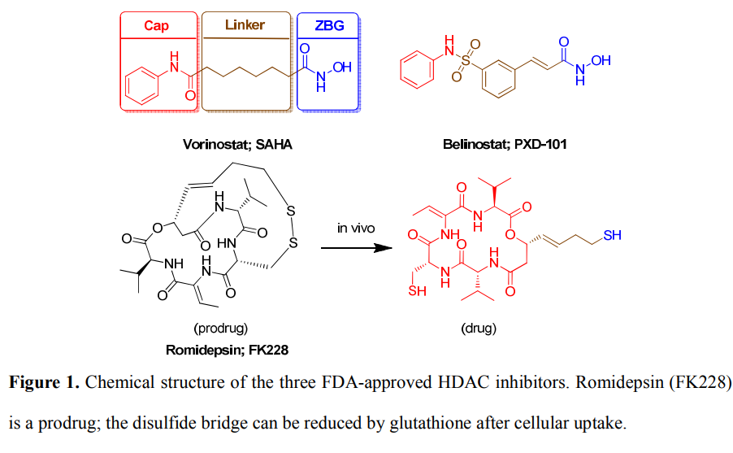
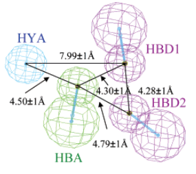

虚拟筛选 (Virtual Screening, VS)
===========================================

虚拟筛选在药物发现中的意义 The significance of virtual screening in drug discovery
--------------------------------------------------------------------------------------------------------------

筛选途径的药物发现方法
:::::::::::::::::::::::::::

实验筛选：是使用生物物理、生物化学等方法鉴别小分子和蛋白质的相互作用，从而筛选出对蛋白质功能有调节作用的先导化合物。基于大规模化合物库的实验筛选也称为高通量筛选（HTS）。

虚拟筛选：是指在进行生物活性筛选之前，根据预先设定的条件，在计算机上对化合物分子进行预筛选，以识别出最可能与靶标结合的小分子，从而大大降低实际筛选化合物数目，同时提高先导化合物的发现效率。

高通量筛选VS虚拟筛选
::::::::::::::::::::::::::

============================== =================
高通量筛选                       虚拟筛选
============================== =================
体外活性测试（大量测试）          计算机模拟分析
命中率：0.01‐0.001% 假阴性较高     命中率：2‐24%
需要先有大量化合物               仅需测试少量化合物
============================== =================

虚拟筛选文章统计
:::::::::::::::::::::::::::

虚拟筛选的基本流程 The basic process of virtual screening
-----------------------------------------------------------------

虚拟筛选的通用流程
:::::::::::::::::::::::::

虚拟筛选化合物数据库
::::::::::::::::::::::::

常用数据库： 

ZINC、PubChem、DrugBank、ChEMBL、ChemDB、HMDB、BindingDB、SMPDB。

常用化合物库介绍：

1） 筛选化合物库分类：多样性化合物库、上市药物分子库、已知活性库、靶点化合物库，天然产物库，片段库等等；

2） 常用化合物库品牌：Chemdiv、Enamine、Lifechemicals、Specs、Chembridge、Maybridge、Microsource、Vitas‐M、Interbioscreen等

3） 各品牌化合物的优劣势介绍：

a. ChemDiv：140万库存分子，多样性被认为是商业库中最好的，每年新增20万以上的分子，每年新增的量就和Specs全部的分子数一样多了，而且有很多虚拟筛选的针对各靶点的子库，被大量的高通量筛选的客户选用。
b. Enamine：100万以上，乌克兰的公司，多样性也不错，但价格要高于chemdiv；
c. Lifechemicals：60多万种分子，库存量充足，如部分产品库存不足可很快完成合成及补充工作，进入中国市场较晚，价格中等；
d. SPECS：20多万种分子，价格最便宜，最早进入中国市场，已经被各大研究单位无数次的反复筛选过。化合物更新较慢，溶解性，多样性都相对比较差；
e. Chembridge：有70万种小分子，将化合物分成1，2，3 或4类，价格都不一样，是依赖于化合物合成的难易来分的。相对价格较贵

化合物数据库的预处理
::::::::::::::::::::::::::

1、类药性分析

目的：排除理化参数不佳的化合物, 降低筛选成本。保留具有一定类药性(drug‐likeness) 特点的化合物

================== ======= ========
参数               最小值    最大值
================== ======= ========
logP                ‐2      5
分子量              200      500
氢键给体            0        5
氢键受体            0        10
摩尔折射率          40       130
旋转键数目          0        10
重原子数目          20       70
极性表面积（tPSA）   0 A²    120 A²
电荷                ‐2      2
================== ======= ========

2、假阳性分子排除

目的：一些化合物易于与生物大分子发生化学反应, 在基于受体、酶或细胞检测实验中总是表现为阳性, 而实际上为假阳性。

虚拟筛选的不同方法
::::::::::::::::::::::::::

基于分子对接的虚拟筛选步骤
^^^^^^^^^^^^^^^^^^^^^^^^^^^^^^^

参考：http://dx.doi.org/10.1038/nchembio.2334

作者通过同源模建构建了MRGPRX2蛋白结构，在此基础上通过分子对接成功找到了一个选择性的激动剂，并得到实验验证，可作为药物开发的先导化合物。

基于片段设计的虚拟筛选步骤
^^^^^^^^^^^^^^^^^^^^^^^^^^^^^

基于片段的药物发现方法的主要内容是设计并建立由片段分子组成的化合物库，并对库中的片段进行生物活性的筛选从而找到苗头片段分子。再利用X射线晶体学、核磁共振等技术对这些片段与靶蛋白的结合模式与结合强度进行分析,根据这些结构信息对片段分子进行结构优化得到先导化合物。

研究案例

参考：doi:10.1021/jm501982k 

凝血因子VIIa是一种新的抗血栓形成靶标，与S1口结合的大多数因子VIIa抑制剂包含疏水和阳离子基团，导致不好的膜渗透性和口服吸收。为了发现中性S1靶向抑制剂并改善药代动力学特征，Cheney等研究人员进行了基于片段的虚拟筛选研究。

代表性命中片段（K_i = 8.9mM）与凝血因子VIIa S1口袋结合并与氨基酸残基Gly218形成氢键。基于命中片段内酰胺的结合模式，发现了许多具有良好抑制效能和改善渗透性的类似物。如化合物5是细胞可渗透的，并且具有130 nM的K_i值。

基于药效团模型的虚拟筛选步骤

参考：doi:10.1021/ci500762z 

研究案例：人组蛋白去乙酰化酶（HDACs）作为表观遗传调控的关键因子，已被确定为治疗多种癌症的药物靶标。总结现有的HDAC抑制剂发现，都存在一个锌结合位点（zinc‐binding group，ZBG）。

药效团的构建

模型验证：构建诱饵分子库：包含134个已报道的HDAC8抑制剂和10000个无活性的诱饵分子

筛选策略

基于相似性搜索的虚拟筛选

首先需要将已知的活性化合物和数据库中化合物进行相似性计算打分，得分越高的分子相似性越大；然后根据设定的相似性阈值，将满足相似性要求的分子从数据库中挑选出来。

研究案例1

参考：DOI: 10.1016/j.ejmech.2012.04.041

雌激素受体（ERs）是ER阳性乳腺癌和骨质疏松症的有效靶标。亚型选择性配体的数量的增加有助于ERa和ERb之间的差异的研究。

研究方法：

1.基于分子相似性使用参考化合物对SPECS数据库进行相似性搜索，相似系数设定为0.45‐0.99；所有命中化合物进行基于对接的虚拟筛选，最终获得具有合适结合构象的化合物；

2.购买纯度合适的命中化合物；

3.运用不同生物技术对化合物进行活性评估。

通过相似搜索和分子对接的组合策略的虚拟筛选，发现了21种化合物作为雌激素受体的有效配体，其中两个具有高的抑制率（> 70％）。

研究案例2

参考：https://www.ncbi.nlm.nih.gov/pmc/articles/PMC4871132/

使用夫西地酸作为提问结构进行基于2D和3D相似性的虚拟筛选得到新型抗疟疾药。

不同虚拟筛选方法的联合应用

SBDD以锁匙模型为基础，寻找可以与靶标结合的配体分子；而SBDD以相似性原理为基础，寻找与已知抑制剂具有潜在相同作用方式的配体分子。SBDD结果准确，可直接预测结合能，缺点是需要受体结构，速度慢；LBDD速度快，无需蛋白结构，但是有时由于缺乏具体结合方式的指导，结果外推时常常误差很大。这两种方法、理论是独立发展，各有其适用条件和利弊的。所以一个虚拟筛选项目通常会整合多种CADD技术。

案例学习 Case studies
---------------------------------

药效团模型为主的虚拟筛选方法
:::::::::::::::::::::::::::::::

案例1.  HIV‐1整合酶抑制剂的发现

参考：https://doi.org/10.1021/jm050837a

训练集：

药效团模型：

2个氢键给体、1个氢键受体、1个芳环中心

数据库搜索：

案例2. HIV‐1整合酶抑制剂的改造

参考：https://doi.org/10.1021/jm050549e

训练集：

药效团模型（具有活性预测能力的药效团）：

2个氢键受体，1个氢键给体，1个芳环中心

活性预测：

药效团活性预测结果与最终的实验活性测定结果进行比较，结果非常一致，线性相关常数r达0.85。

化合物改造

16个化合物中，有一个化合物与药效团模型的匹配方式如图A所示，该化合物只能与药效团中的三个特征相匹配，芳香疏水中心没有匹配上。依据这一信息，研究者在该化合物上添加了一个疏水的芳环侧链，然后进行了活性测试。发现改造之后的化合物（如图B）所示，与之前相比，活性有了很大的提高。

案例3. 基于CBP模型发现新型Lyp抑制剂

参考：https://doi.org/10.1021/jm500692u

药效团模型构建案例：

对接及其打分函数评价（诱饵分子库包括52个活性分子和2950个无活性的诱饵分子）

虚拟筛选方案：

